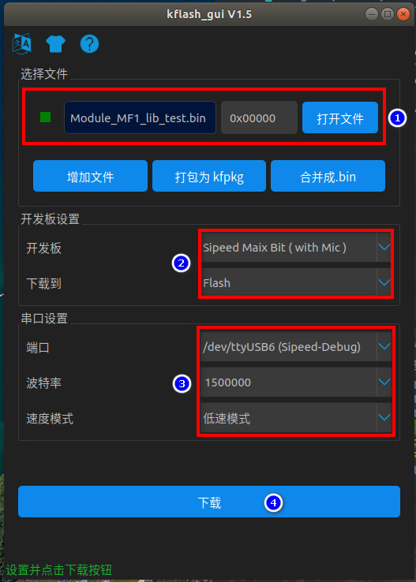
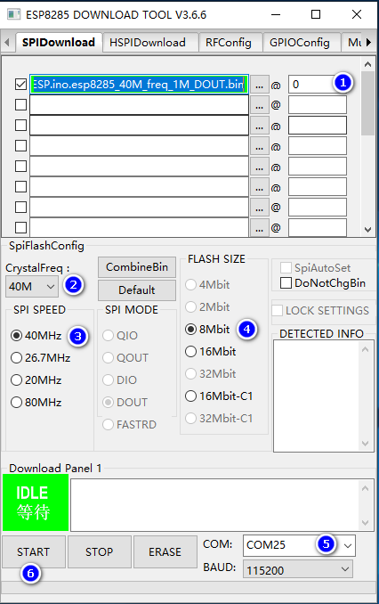

# MF1模块二次开发说明

### 如果有任何的需求或者BUG,请发邮件至**support@sipeed.com**

### `SDK`中只包含固件代码，模型文件需要另外生成（出厂已烧录），具体请邮件联系我们

## 目录

- [工程目录说明](#工程目录说明)    
- [工程编译](#工程编译)    
- [下载固件](#下载固件)    
- [升级`ESP8285`固件](#升级`ESP8285`固件)
- [人脸识别库API说明](#人脸识别库api说明)        
    - [人脸识别API](#人脸识别api)        
    - [串口协议库API](#串口协议库api)        
    - [FLASH读写API](#flash读写api)        
    - [CAMERA操作API](#camera操作api) 
- [`Driver` 目录说明](#driver-目录说明)  
    - [`Flash` API说明](#flash-api说明)    
    - [`Sd_card` API说明](#sd_card-api说明)   
- [`lib` 目录说明](#lib-目录说明)
    - [`base64` API说明](#base64-api说明)
    - [`cJSON` API说明](#cjson-api说明)
    - [`jpeg_compress` API说明](#jpeg_compress-api说明)
    - [`jpeg_decode` API说明](#jpeg_decode-api说明)
    - [`oofatfs` API说明](#oofatfs-api说明)
    - [`fmath` API说明](#fmath-api说明)
    - [`img_op` API说明](#img_op-api说明)
    - [`sd_op` API说明](#sd_op-api说明)
- [`ui` 目录说明](#ui-目录说明)
- [`uart_recv` 目录说明](#uart_recv-目录说明)
- [`network` 目录说明](#network-目录说明)
    - [`http` API说明](#http-api说明)
    - [`mqtt` API说明](#mqtt-api说明)
    - [`qrcode` API说明](#qrcode-api说明)
    - [`wifi` API说明](#wifi-api说明)
    - [`net_8285.c` API说明](#net_8285c-api说明)

## 工程目录说明

本工程基于[kendryte-standalone-sdk](https://github.com/kendryte/kendryte-standalone-sdk)

！！！[`SDK`](https://github.com/sipeed/MF1_SDK)下载连接！！！，工具链[下载链接](https://github.com/kendryte/kendryte-gnu-toolchain/releases)

用户只需要关心`src/Ai_Module_MF1_lib_test`目录下的文件

| | |
|-|-|
|.  |   |
|├── board.c            | 板子外设的初始化等  |
|├── board.h||
|├── build  | 编译目录  |
|├── driver |  板子外设驱动目录,包含lcd,flash,sd_card等 |
|├── face_lib   | 人脸识别库,以及一些回调操作  |
|├── lib    | 一些使用到的第三方库  |
|├── main.c |  主函数 |
|├── network    |esp8285网络驱动|
|├── project.cmake  |   |
|├── README.md  |   |
|├── system_config.h    | 系统配置  |
|├── uart_recv  |  串口协议接受处理 |
|└── ui |  ui操作 |

## 工程编译

> 建议使用`Ubuntu`或其他`Linux`发行版进行编译，本工程并未在`Kendryte-IDE`中验证过

在`src/Ai_Module_MF1_lib_test`目录下打开终端，执行
```BASH
cd build
cmake ../../../ && make
```
开始编译，编译完成后，在`build`目录下生成`Ai_Module_MF1_lib_test.bin`,使用工具烧录到模块中

## 下载固件

<center class="half">

</center>
  
用户可以使用`kflash_gui`来下载程序
  
具体流程为：

- ① 打开需要烧录的固件，

  如果是`bin`文件，请确保地址为`0x00`,
  
  是`kfpkg`文件时，不需要选择地址

- ② 选择开发板型号，`MF1`模块请选择`Sipeed Maix Bit With Mic`

- ③ 选择串口，`MF1`模块，请选择第一个串口

- ④ 点击`下载`，开始下载
  
## 升级`ESP8285`固件

现在（2019.08.14之前）`esp8285`出厂默认烧录的是`AT`固件，在`MF1`中使用的是`SPI`与模块进行通信，所以需要更新一下固件。

**更新`esp8285`固件，需要将使能引脚打开，烧录[预编译好的固件](http://dl.sipeed.com/MAIX/HDK/factory_firmware/Ai_Module_MF1_lib_wifi_on.bin)来使能`wifi`**

<center class="half">

</center>

①：短接这个触点到`GND`然后上电

②：使用这个串口进行`esp82825`的固件更新

`esp8285 SPI`固件[下载地址](http://dl.sipeed.com/MAIX/HDK/factory_firmware/esp8266/WiFiSPIESP.ino.esp8285_40M_freq_1M_DOUT.bin)

`flash_download_tools`[下载地址](https://www.espressif.com/sites/default/files/tools/flash_download_tools_v3.6.6.zip)

`flash_download_tools`下载选项

<center class="half">

</center>

〇：注意选择`ESP8285`下载，**千万不要**选择了`ESP8266`

①：选择之前下载的固件，地址为`0`

②：选择晶振频率为`40M`

③：选择`flash`频率为`40M`

④：选择`flash`大小为`8Mbit`

⑤：选择对应的串口，**波特率建议选择为115200**

⑥：点击开始下载

## 人脸识别库API说明

### 人脸识别API
```C
uint8_t face_lib_init_module(void);
```
初始化人脸识别库,返回值为0的时候模块才可正常使用

```C
uint8_t face_lib_regisiter_callback(face_lib_callback_t *cfg_cb);
```
注册人脸识别过程中一些事件回调函数,请参考例程中已经实现的函数

```C
void face_lib_run(face_recognition_cfg_t *cfg);
```
进行人脸识别,需要摄像头是正常的,用户可以设置一些配置信息

### 串口协议库API

> 可以使用`mqtt`进行通信，但是目前无法计算图片的特征值。

```C
uint8_t protocol_send_init_done(void);
```
模块初始化完成

```C
void protocol_prase(unsigned char *protocol_buf);
```
进行协议数据的解析,目前仅支持内置一些的指令,之后用户可添加自定义指令

```C
void protocol_cal_pic_fea(uint8_t *jpeg_buf, uint32_t jpeg_len);
```
接收完图片之后进行图片特征值的计算

```C
uint8_t protocol_send_cal_pic_result(uint8_t code, char *msg, float feature[FEATURE_DIMENSION], uint8_t *uid, float prob);
```
发送计算图片特征值结果

```C
uint8_t protocol_send_face_info(face_obj_t *obj,
                                float score, uint8_t uid[UID_LEN], float feature[FEATURE_DIMENSION],
                                uint32_t total, uint32_t current, uint64_t *time);
```
识别到人脸之后,发送人脸信息,具体的使用方法请参考例程

```C
extern volatile uint8_t face_lib_draw_flag;
```
lib中是否要调用来绘图标志

### FLASH读写API

```C
w25qxx_status_t w25qxx_init(uint8_t spi_index, uint8_t spi_ss, uint32_t rate);
w25qxx_status_t w25qxx_read_id(uint8_t *manuf_id, uint8_t *device_id);
w25qxx_status_t w25qxx_write_data(uint32_t addr, uint8_t *data_buf, uint32_t length);
w25qxx_status_t w25qxx_read_data(uint32_t addr, uint8_t *data_buf, uint32_t length);
w25qxx_status_t my_w25qxx_read_data(uint32_t addr, uint8_t *data_buf, uint32_t length, w25qxx_read_t mode);
```

对板载的16MByte FLASH的读写API

### CAMERA操作API

```C
int dvp_irq(void *ctx);
```
DVP中断回调,在Board.c中进行注册

```C
int gc0328_init(void);
```
GC0328初始化,在Board.c中调用，初始化摄像头

```C
extern volatile uint8_t g_dvp_finish_flag；
```
摄像头接收完一帧标志


## `Driver` 目录说明

| | |
|-|-|
|.||
|├── flash.c|flash 读写|
|├── flash.h||
|├── font.c|lcd显示字库|
|├── font.h||
|├── lcd_sipeed|`sipeed`的`lcd`驱动板驱动程序，暂未调试好|
|├── lcd_ssd1963|`ssd1963`屏幕控制器驱动，内存占用过大，暂不支持|
|├── lcd_st7789|板载`st7789`屏幕控制器驱动，默认使用|
|├── sd_card.c|`gpio`模拟的`sd_card`驱动|
|└── sd_card.h||

### `Flash` API说明

```C
void flash_init(void);
```
`flash`初始化

```C
int flash_delete_face_info(uint32_t id);
```
删除保存在flash中，指定`id`对应的人脸信息

```C
int flash_delete_face_all(void);
```
删除`flash`中的所有人脸信息

```C
int flash_save_face_info(uint8_t *image, float *features, uint8_t *uid, uint32_t valid, char *name, char *note, uint8_t *ret_uid);
```
保存人脸信息到`flash`中，`features`与`uid`必需

```C
int flash_get_saved_faceinfo(face_info_t *info, uint32_t index);
```
从`flash`中读取指定`index`的信息

```C
uint32_t flash_get_id_by_uid(uint8_t *uid);
```
使用`uid`获取对应的`id`

```C
uint8_t flash_load_cfg(board_cfg_t *cfg);
uint8_t flash_save_cfg(board_cfg_t *cfg);
uint8_t flash_cfg_print(board_cfg_t *cfg);
uint8_t flash_cfg_set_default(board_cfg_t *cfg);
```
使用`flash`保存一些配置，用户可添加自己的配置，但不可删除已有的

### `Sd_card` API说明

```C
uint8_t SD_Initialize(void);
uint8_t SD_ReadDisk(uint8_t *buf, uint32_t sector, uint8_t cnt);
uint8_t SD_WriteDisk(uint8_t *buf, uint32_t sector, uint8_t cnt);
```
`Sd_card`初始化与读写，用户不需要关心，只需要使用文件系统进行操作即可


## `lib` 目录说明

| | |
|-|-|
|.| |
|├── base64|base64编解码|
|├── cJSON| cJOSN解析库|
|├── fmath.c| 数学库函数实现|
|├── fmath.h|   |
|├── img_op.c| 一些图片的操作|
|├── img_op.h|  |
|├── jpeg_compress| jpeg图片压缩|
|├── jpeg_decode|  jpeg解码 |
|├── oofatfs|  `sd_card`文件系统 |
|├── sd_op.c|  `sd_card`文件系统封装的一些操作 |
|└── sd_op.h|   |

### `base64` API说明

```C
unsigned char *base64_encode(const unsigned char *src, size_t len, size_t *out_len);
unsigned char *base64_decode(const unsigned char *src, size_t len, size_t *out_len);
```
`base64`编解码

### `cJSON` API说明

`cJSON`是一个很成熟的库了，具体的使用请百度或者谷歌。

### `jpeg_compress` API说明

```C
uint8_t reverse_u32pixel(uint32_t *addr, uint32_t length);
```
由于`dvp`输出的`rgb565`图像字节序有问题，所以在进行`jpeg`编码之前，需要将图像进行一次字节序调整

```C
bool jpeg_compress(jpeg_encode_t *src, jpeg_encode_t *dst, int quality, bool realloc);
```
`jpeg`编码函数

Demo

```C
    jpeg_encode_t jpeg_src, jpeg_out;
    //image_tmp,中间变量
    //display_image,dvp输出图像缓存
    memcpy(image_tmp, display_image, IMG_W * IMG_H * 2);
    reverse_u32pixel(image_tmp, 320 * 240 / 2);

    jpeg_src.w = 320;
    jpeg_src.h = 240;
    jpeg_src.bpp = 2;
    jpeg_src.data = image_tmp;

    jpeg_out.w = jpeg_src.w;
    jpeg_out.h = jpeg_src.h;
    jpeg_out.bpp = JPEG_BUF_LEN;
    jpeg_out.data = jpeg_buf;//jpeg编码输出缓存

    if(jpeg_compress(&jpeg_src, &jpeg_out, 80, 0) == 0)
    {
        printf("w:%d\th:%d\tbpp:%d\r\n", jpeg_out.w, jpeg_out.h, jpeg_out.bpp);
    } else
    {
        printf("jpeg encode failed\r\n");
        return;
    }
```

### `jpeg_decode` API说明

用户只需要关心`picojpeg_util.h`中的函数

```C
//out_img,解码输出缓存
//buf,jpeg图片缓存
//buf_len，jpeg图片缓存大小
//rgb565，是否解码为rgb565，为0时，解码输出为rgb888
jpeg_decode_image_t *pico_jpeg_decode(uint8_t *out_img, uint8_t *buf, uint32_t buf_len, uint8_t rgb565);
```
解码`jpeg`图片，

### `oofatfs` API说明

文件系统的操作，请参考[oofatfs文档](https://github.com/micropython/oofatfs)

### `fmath` API说明

用户基本不使用，不用关心

### `img_op` API说明

一些图片的基本操作

### `sd_op` API说明

暂时未封装太多文件系统读写操作，之后添加

## `ui` 目录说明

保存了一些`ui`图片资源

## `uart_recv` 目录说明

串口通信协议的一些操作，主要是串口接受，以及外设控制

## `network` 目录说明
| | |
|-|-|
|.  |       |
|├── http   |http通信|
|│   ├── http_file.c    |http post和get文件|
|│   ├── http_file.h    |       |
|│   ├── http_save_file.c   |http接受服务器返回|
|│   ├── http_save_file.h   |       |
|│   ├── http_simple.c  |http普通操作|
|│   ├── http_simple.h  |       |
|│   ├── mt_str.c   |       |
|│   ├── my_str.h   |       |
|│   ├── parsed_url.c   |解析url|
|│   └── parsed_url.h   |       |
|├── mqtt   |       |
|│   ├── PubSubClient.c |mqtt通信|
|│   └── PubSubClient.h |       |
|├── net_8285.c |封装的一些网络操作|
|├── net_8285.h |       |
|├── qrcode |       |
|│   ├── qrcode.c   |二维码识别|
|│   └── qrcode.h   |       |
|└── wifi   |       |
|    ├── spi    |spi驱动|
|    ├── utility    |       |
|    ├── WiFiSpi.c  |       |
|    ├── WiFiSpiClient.c    |       |
|    ├── WiFiSpiClient.h    |       |
|    ├── WiFiSpi.h  |       |
|    ├── WiFiSpiServer.c    |       |
|    ├── WiFiSpiServer.h    |       |
|    ├── WiFiSpiUdp.c   |       |
|    └── WiFiSpiUdp.h   |       |

### `http` API说明

```C
uint32_t http_get_file(char *url,
                       char *custom_headers,
                       char *resp_header,
                       uint32_t resp_header_len,
                       uint8_t *file,
                       uint32_t file_len);

uint32_t http_post_file(char *url,
                        char *custom_headers,
                        uint8_t *body,
                        uint8_t *boundary,
                        uint8_t *post_file,
                        uint32_t post_file_len,
                        char *resp_header,
                        uint32_t resp_header_len,
                        uint8_t *file,
                        uint32_t file_len);
```

使用`http`进行`post`和`get`文件

Demo

```C
    uint32_t get_recv_len = http_get_file(
        srv_url,//请求地址
        NULL,//自定义请求头
        http_header,//服务器返回的头
        sizeof(http_header),//长度
        http_body,//接受缓存
        sizeof(http_body));//长度
```

```C
    uint32_t post_recv_len = http_post_file(
        http_upload_face,//请求地址
        send_hdr,//请求头
        NULL,//post的body内容
        NULL,//分割字符串，可不用
        upload->jpeg_addr,//post的文件地址
        upload->jpeg_len,//post的文件长度
        http_header,//服务器返回的头
        sizeof(http_header),//长度
        http_body,//接受缓存
        sizeof(http_body));//长度
```

```C
uint32_t http_save_file(uint8_t sock, char *resp_header, uint32_t resp_header_len, uint8_t *file, uint32_t file_len);
```
解析服务器返回的数据，不用关心

其他文件用户不需关心

### `mqtt` API说明

```C
uint8_t PubSubClient_connect0(const char *id);
uint8_t PubSubClient_connect1(const char *id, const char *user, const char *pass);
uint8_t PubSubClient_connect2(const char *id, const char *willTopic, uint8_t willQos, uint8_t willRetain, const char *willMessage);
uint8_t PubSubClient_connect3(const char *id, const char *user, const char *pass, const char *willTopic, uint8_t willQos, uint8_t willRetain, const char *willMessage);
```
连接mqtt服务器，用户选择自己需要的函数使用

```C
uint8_t PubSubClient_loop(void);
```
主函数中调用，发送心跳包，以及接受数据

```C
uint8_t PubSubClient_publish(const char *topic, const uint8_t *payload, unsigned int plength);
```
发布消息

```C
uint8_t PubSubClient_subscribe(const char *topic, uint8_t qos);
```
订阅主题

```C
uint8_t PubSubClient_unsubscribe(const char *topic);
```
取消订阅主题

```C
uint8_t PubSubClient_connected(void);
```
判断是否连接到服务器，若没有，需要进行重连

### `qrcode` API说明

```C
uint8_t find_qrcodes(qrcode_result_t *out, qrcode_image_t *img);
```
识别二维码，具体的使用方法请参考例程`net_8285.c`

### `wifi` API说明

包含`8285`的驱动，用户不用关心

### `net_8285.c` API说明

```C
qr_wifi_info_t *qrcode_get_wifi_cfg(void);
```
扫描二维码，获取`wifi`配置信息，二维码格式`{"t":"84:0D:8E:6C:62:9C","w":"Sipeed_2.4G","p":"Sipeed123."}`

`t`:模块的`MAC`地址，在初始化中有打印

`w`:热点的名称

`p`:热点的密码

> 生成的二维码版本不能太高，以及容错级别要为`L`,建议使用[barcodegenerator](https://racoindustries.com/barcodegenerator/2d/qr-code/)来生成


```C
uint8_t spi_8266_init_device(void);
```
初始化`8285`模块

```C
uint8_t spi_8266_connect_ap(uint8_t wifi_ssid[32],
                            uint8_t wifi_passwd[32],
                            uint8_t timeout_n10s);
```
连接对应`ssid`

```C
void mqtt_reconnect(void);
```
mqtt掉线重连

```C
uint8_t spi_8266_mqtt_init(void);
```
初始化`mqtt`连接，用户可修改连接的服务器以及`topic`等

```C
void spi_8266_mqtt_send(char *buf,size_t len);
```
通过`mqtt`发送数据

> 如果使用`WIFI`,需要修改`system_config.h`中的`CONFIG_ENABLE_WIFI`为`1`
