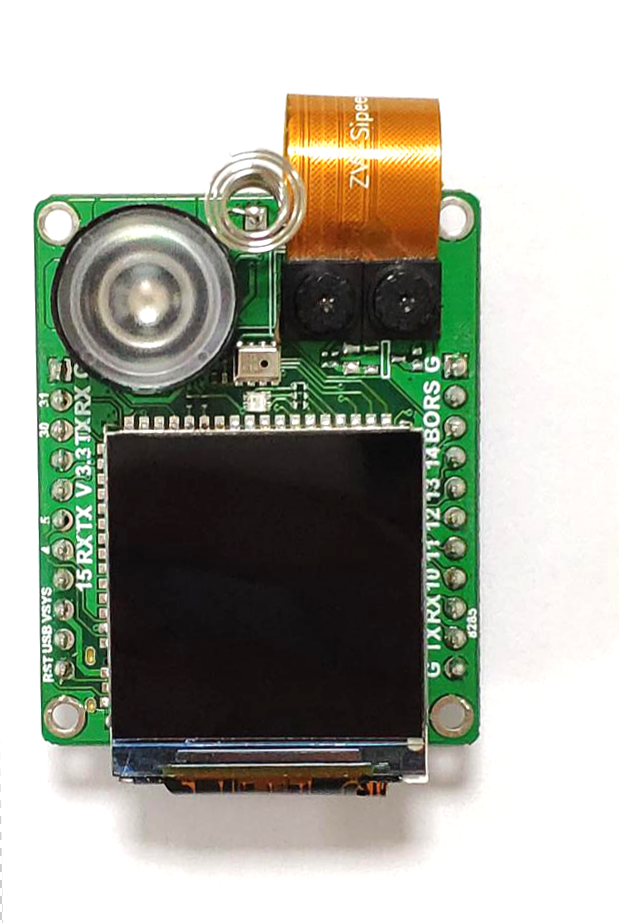
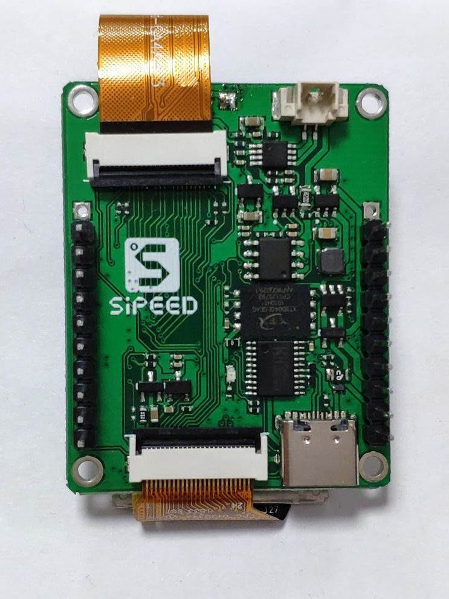

# `MF1` 模块用户手册

## **修改记录**

|版本|时间|修改内容|
|-|-|-|
|1.0|2019.07.30|初始版本|

## 目录

- [**硬件资源简介**](#硬件资源简介)    
- [**功能简介**](#功能简介)        
    - [模块特性](#模块特性)        
    - [使用说明](#使用说明)        
- [**应用方案**](#应用方案)            
    - [串口模块](#串口模块)            
    - [微信小程序模块](#微信小程序模块)            
    - [二次开发](#二次开发)    
- [**Q&A**](#qa)

## **硬件资源简介**

* CPU : RISC-V 双核64bit、内置FPU、频率400Mhz-500Mhz
* 图像识别：活体识别
* 双摄像头：红外+可见光
* 红外填充光：3W红外发光二极管
* 显示器：1.33英寸TFT、分辨率240*320显示屏
* 其他外设：电容触摸按钮/支持3W扬声器/MEMS麦克风/SD NAND/RGB LED
* 无线功能（可选) : 支持 2.4G 802.11.b/g/n、SPI 连接

* [淘宝购买](https://item.taobao.com/item.htm?spm=a1z10.1-c.w4004-21231188695.25.27ba52b1bsusf7&id=599138281058)

## **功能简介**

### 模块特性

|||
|-|-|
|核心活体人脸识别模块，通过双光谱摄像头进行人脸识别，并判断是否活体，|
|可防护 屏幕图片/视频 攻击，彩色/黑白 激光/喷墨 打印纸攻击|
|适用于 室内 及 半室外（无阳光直射）环境，通用于 白天/黑夜（暗光环境自动切换至红外识别|
|默认镜头的识别距离为40~80cm， 可定制镜头获得更远距离的识别|
|开机启动时间约0.2~0.3s，从上电到识别到第一张人脸的时间在0.4~0.5s|
|存储人脸特征值数量 最大约一万张，选配SDNAND可存储4K张人脸图片|
|人脸识别准确率 98% @ 0.001 FA|

### 使用说明

|||
|-|-|
|MF1模块上部弹簧为触摸按键，通过按键录入，删除 记录。|
|录入方法：模块正对待录入人脸，人脸尽量充满屏幕，看见人脸被红框框住时，短按按键，屏幕会显示“录入成功”字样|
|删除记录：长按按键1s以上即可删除所有记录|
|识别：在识别距离内（40~80cm，基本就是臂展之内），出现已录入的人脸，即可快速识别，含活体的识别时间在0.2~0.3s|
|暗光识别：在室内环境较暗，或者夜晚时，MF1自动切换至红外识别模式，表现为屏幕显示近红外的人脸图像。|
  
|||
|-|-|
|核心模块可选配不同尺寸的屏幕，底板等，详细配置见附件的选型表|

### **应用方案**

#### 串口模块

基于Json的串口通信协议，提供解析库，具体的协议见[协议文档](xxxxxx)
  
串口模块使用简洁，用户可以很快速的集成到自己的系统，但是自由度相对较小

#### 微信小程序模块

通过SPI连接到8285，可通过我们的微信小程序进行人脸的录入，以及记录的查看

#### 二次开发

适合有很好技术基础的用户使用，不需要外接其他MCU，有更高的自由度进行开发
  

## **Q&A**

* Q: 怎么更新固件
  
  A: 请参考[更新MaixPy固件](https://maixpy.sipeed.com/zh/get_started/upgrade_firmware.html)，在板子选型中请选择`Sipeed Maix Bit With Mic`，出现两个串口的时候，选择第一个串口

* Q: 使用过程中有什么需要注意的

  A: 上电后请握住USB插头部分（防止误触触摸按键）

* Q: 供电方式

  A: 模块可以使用USB5V供电，或者外接底板使用电池或者电源
