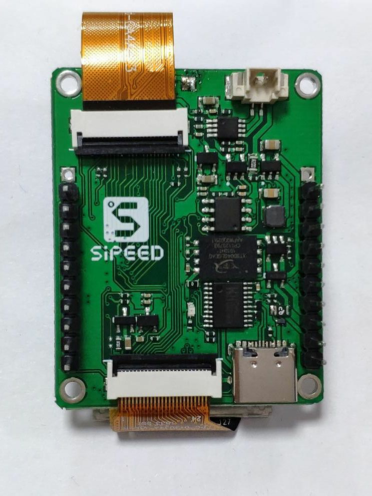
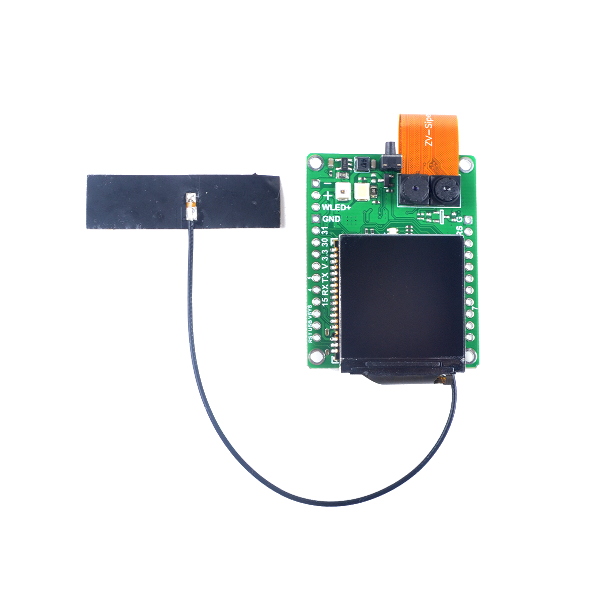
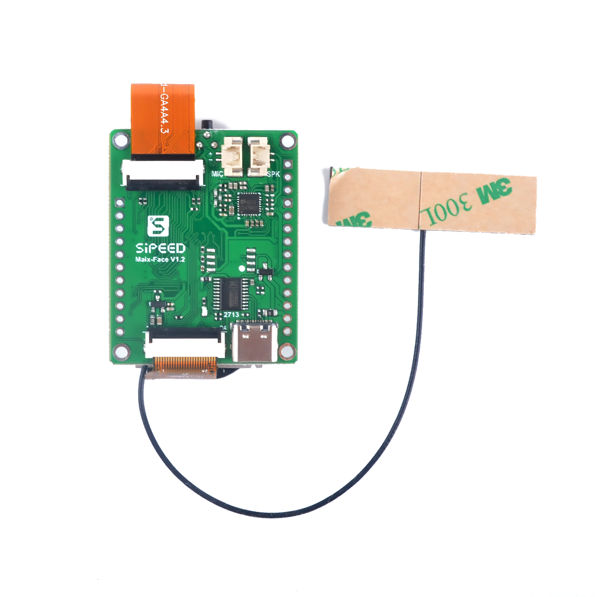
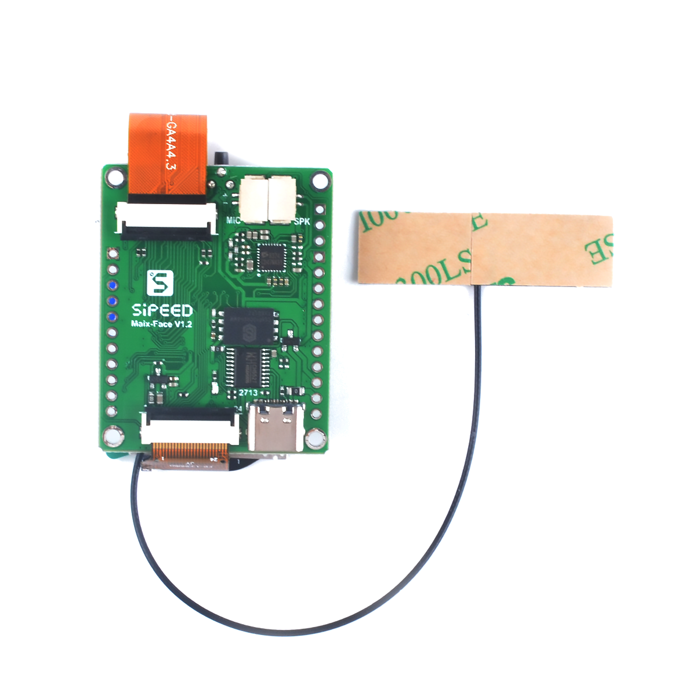

# MF-User-Manual

[ English | [中文](./README_ZH.md)]

MF Face Recognition Module User Manual

- [`MF0` Module Concise User Manual](./en_US/mf0_get_started_en_US.md)
- [`MF1` V1 Module Concise User Manual](./en_US/m01_mf1_v1_get_started.md)
- [`MF1` V2 Module Concise User Manual](./en_US/m02_mf1_v2_get_started.md)
- [`MF` Module General HEX Protocol](./en_US/p02_mf_protocol_manual_v2_hex_en_US.md)
- [`MF` Module General JSON Protocol](./en_US/p03_mf_protocol_manual_v2_json_en_US.md)
- [MF1 firmware update instructions (and machine code key acquisition instructions)](./en_US/k01_update_firmware_and_get_key.md)
-[MF Sipeed serial debugging assistant instructions for use](./en_US/t01_mf_sipeed_serail_port_tools.md)

## About MF face recognition module

- Existing MF face recognition module

| Module/Development Board | Description |
| --- | --- |
| MF0 | Core Board |
| MF1 | 1.3 inch IPS screen |
| MF1_TO_MF2 | MF1 external 2.4/2.8 inch screen |
| MF2 | 86 |
| MF4 | Customized version |
| MF5 | Finished product |
| MF5-QT version | |

## MF board type list

### MF1 old version (V1)

! The old version of the firmware function is no longer maintained

<table border="1">
    <tr>
        <th colspan=3>MF1(V1) </th>
    </tr>
    <tr>
        <td widtd="100">description</td>
        <td >front view</td>
        <td>Bottom view(with NAND) </td>
    </tr>
    <tr>
        <td width="100">MF1 1.3' LCD</td>
        <td>
            
        </td>
        <td>
            
        </td>
    </tr>
</table>

### MF1 New version(V2)

<table border="1">
    <tr>
        <th colspan=4>MF1(V2)</th>
    </tr>
    <tr>
        <td  width="100">description</td>
        <td>front view </td>
        <td>Bottom view(without NAND) </td>
        <td>Bottom view(with NAND) </td>
    </tr>
    <tr>
        <td width="100">MF1 1.3' LCD</td>
        <td>
            
        </td>
        <td>
            
        </td>
        <td>
            
        </td>
    </tr>
    <tr>
        <td>MF1 TO MF2 2.4/2.8' LCD</td>
        <td>
              TODO: The picture is MF1 1.3', to be updated 
            
        </td>
        <td>
              TODO: The picture is MF1 1.3', to be updated 
            
        </td>
        <td>
              TODO: The picture is MF1 1.3', to be updated 
            
        </td>
    </tr>
</table>
