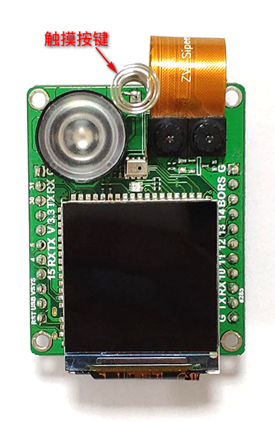

# MF1 module  get started

- [1. Install driver](#1. Install driver)
- [2. Download firmware](#2. Download firmware)
- [3. Face feature recording and deletion](#3. Face feature recording and deletion)
- [4. Serial communication protocol](#4. Serial communication protocol)

## 1. Install driver

`MF1` module onboard a `CH552`, use the serial port function to install the `FT2232` driver.

Users can download the driver on the  [FTDIofficial website](https://www.ftdichip.com/Drivers/VCP.htm) , please select the installation package corresponding to your computer operating system.

Please refer to [Description](https://www.ftdichip.com/Support/Documents/InstallGuides.htm) for the specific installation method. The process of installing the driver is clearly written in the documentation. Please read the documentation carefully.

After installing the system, you may not be able to see the second serial port.

Open the device manager, find the second serial port, right click and select `Properties`, select enable `VCP`, re-plug the device to see the serial port appear.

## 2. Download firmware

Users can download programs using `kflash_gui` (https://github.com/sipeed/kflash_gui/releases ).

The specific process is:

- ① Open the firmware you need to burn. If it is a `bin` file, make sure the address is `0x00`. If it is a `kfpkg` file, you do not need to select the address.

- ② Select the development board model, the `MF1` module, please select `Sipeed Maix Bit With Mic`.

- ③ Select serial port, `MF1` module, please select the first serial port.

- ④ Click `Download` to start downloading.

## 3. Face feature recording and deletion

Onboard a touch button with a spring.

Please fill the face with the preview of the `LCD`. After the red frame on the face frame, touch the spring button and you can enter the face.

Press and hold the button to delete all stored face information and restore the default configuration information.

## 4. Serial communication protocol

Please refer to the specific [Protocol Document] (MF1 module serial communication protocol.md)
