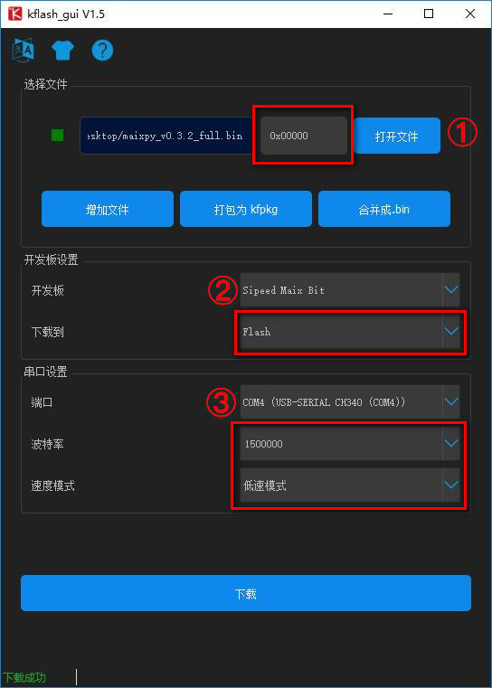
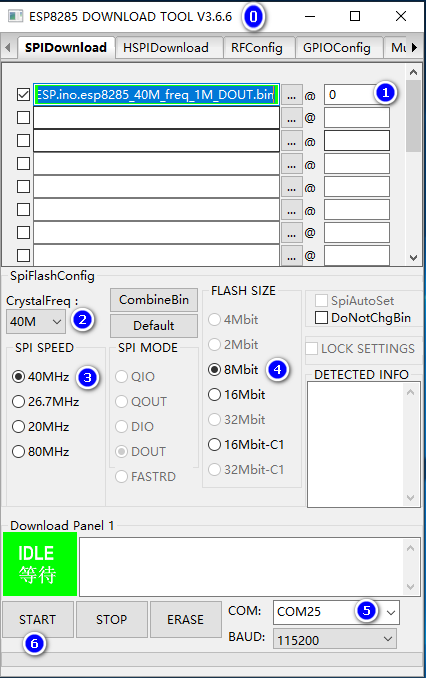

# MF1 module secondary development instructions


- [1. Project directory description](#1-Project-directory-description)    
- [2. Project compilation](#2-Project-compilation)    
- [3. Download firmware](#3-Download-firmware)    
- [4. Upgrade ESP8285 firmware](#4-Upgrade-ESP8285-firmware)
- [5. Face Recognition Library API Description](#5-Face-Recognition-Library-API-Description)        
    - [5.1 Face Recognition API](#51-Face-Recognition-API)        
    - [5.2 Serial Protocol Library API](#52-Serial-Protocol-Library-API)        
    - [5.3 FLASH Read and Write API](#53-FLASH-Read-and-Write-API)        
    - [5.4 CAMERA Operation API](#54-CAMERA-Operation-API) 
- [6. Driver Directory Description](6-Driver-Directory-Description)  
    - [6.1 Flash API Description](#61-Flash-API-Description)    
    - [6.2 Sd_card API Description](#62-Sd_card-API-Description)
- [7. lib Directory Description](#7-lib-Directory-Description)
    - [7.1 base64 API Description](#71-base64-API-Description)
    - [7.2 cJSON API Description](#72-cJSON-API-Description)
    - [7.3 jpeg_compress API Description](#73-jpeg_compress-API-Description)
    - [7.4 jpeg_decode API Description](#74-jpeg_decode-API-Description)
    - [7.5 oofatfs API Description](#75-oofatfs-API-Description)
    - [7.6 fmath API Description](#76-fmath-API-Description)
    - [7.7 img_op API Description](#77-img_op-API-Description)
    - [7.8 sd_op API Description](#78-sd_op-API-Description)
- [8. ui Directory Description](#8-ui-Directory-Description)
- [9. uart_recv Directory Description](#9-uart_recv-Directory-Description)
- [10. network Directory Description](#10-network-Directory-Description)
    - [10.1 http API Description](#101-http-API-Description)
    - [10.2 mqtt API Description](#102-mqtt-API-Description)
    - [10.3 qrcode API Description](#103-qrcode-API-Description)
    - [10.4 wifi API Description](#104-wifi-API-Description)
    - [10.5 net_8285.c API Description](#105-net_8285c-API-Description)

> If you have any needs or bugs, please send an email to support@sipeed.com

>The sdk only contains the firmware code, and the model file needs to be generated separately (factory burned). Please contact us by email.

## 1. Project directory description

This project is based on [kendryte-standalone-sdk](https://github.com/kendryte/kendryte-standalone-sdk).

Users only need to care about the files in the `src/Ai_Module_MF1_lib_test` directory.

| | |
|-|-|
|. | |
|├── board.c | Initialization of board peripherals, etc. |
|├── board.h||
|├── build | build directory |
|├── driver | Board peripheral driver directory, including lcd, flash, sd_card, etc. |
|├── face_lib | Face Recognition Library, and some callback operations |
|├── lib | Some third-party libraries used |
|├── main.c | main function |
|├── network |esp8285 network driver|
|├── project.cmake | |
|├── README.md | |
|├── system_config.h | System Configuration |
|├── uart_recv | Serial Port Acceptance Processing |
|└── ui | ui operation |

## 2. Project compilation

> It is recommended to compile with `Ubuntu` or other `Linux` distributions. This project has not been verified in `Kendryte-IDE`.

Open the terminal in the `src/Ai_Module_MF1_lib_test` directory and execute it.
```BASH
cd build
cmake ../../../ && make
```
Start compiling, after the compilation is complete, generate `Ai_Module_MF1_lib_test.bin` in the `build` directory and burn it into the module using the tool.

## 3. Download firmware

<center class="half">

</center>

Users can use `kflash_gui` to download programs.

The specific process is:

1. Open the firmware you need to burn.

   If it is a `bin` file, make sure the address is `0x00`,

   When it is a `kfpkg` file, you do not need to select an address.

2. Select the development board model, the `MF1` module please select `Sipeed Maix Bit With Mic`.

3. Select serial port, `MF1` module, please select the first serial port.

4. Click `Download` to start downloading.

## 4. Upgrade ESP8285 firmware

Now (before 2013.08.14) `esp8285` factory default is the `AT` firmware, the `MF1` is used to communicate with the module, so you need to update the firmware.

**Update the `esp8285` firmware, you need to enable the enable pin and burn [pre-compiled firmware] (http://dl.sipeed.com/MAIX/HDK/factory_firmware/Ai_Module_MF1_lib_wifi_on.bin) to enable it. Wifi`.**

<center class="half">

</center>

1. Short the contact to `GND` and power up.

2. Use this serial port to perform firmware update for `esp82825`.

`esp8285 SPI` firmware [download address](http://dl.sipeed.com/MAIX/HDK/factory_firmware/esp8266/WiFiSPIESP.ino.esp8285_40M_freq_1M_DOUT.bin).

`flash_download_tools`[download address.](https://www.espressif.com/sites/default/files/tools/flash_download_tools_v3.6.6.zip)

`flash_download_tools` download option.

<center class="half">

</center>

> Note to select `ESP8285` to download, **Do not ** select `ESP8266`.

1. Select the previously downloaded firmware, the address is `0`.

2. Select the crystal frequency to be `40M`.

3. Select `flash` frequency is `40M`.

4. Select `flash` size is `8Mbit`.

5. Select the corresponding serial port, ** baud rate is recommended to be 115200**.

6. Click to start downloading.

## 5. Face Recognition Library API Description

### 5.1 Face Recognition API
```C
Uint8_t face_lib_init_module(void);
```
Initialize the face recognition library, the module can be used normally when the return value is 0.

```C
Uint8_t face_lib_regisiter_callback(face_lib_callback_t *cfg_cb);
```
To register some event callback functions in the face recognition process, please refer to the functions already implemented in the routine.

```C
Void face_lib_run(face_recognition_cfg_t *cfg);
```
For face recognition, the camera needs to be normal, and the user can set some configuration information.

### 5.2 Serial Protocol Library API

> You can use `mqtt` to communicate, but it is currently impossible to calculate the feature value of the picture.

```C
Uint8_t protocol_send_init_done(void);
```
Module initialization completed.

```C
Void protocol_prase(unsigned char *protocol_buf);
```
The protocol data is parsed. At present, only some built-in instructions are supported, and then the user can add a custom command.

```C
Void protocol_cal_pic_fea(uint8_t *jpeg_buf, uint32_t jpeg_len);
```
Calculate the image feature value after receiving the image.

```C
Uint8_t protocol_send_cal_pic_result(uint8_t code, char *msg, float feature[FEATURE_DIMENSION], uint8_t *uid, float prob);
```
Send calculated picture feature value results.

```C
Uint8_t protocol_send_face_info(face_obj_t *obj,
                                Float score, uint8_t uid[UID_LEN], float feature[FEATURE_DIMENSION],
                                Uint32_t total, uint32_t current, uint64_t *time);
```
After the face is recognized, the face information is sent. For details, please refer to the routine.

```C
Extern volatile uint8_t face_lib_draw_flag;
```
Whether to call the drawing flag in lib.

### 5.3 FLASH Read and Write API

```C
W25qxx_status_t w25qxx_init(uint8_t spi_index, uint8_t spi_ss, uint32_t rate);
W25qxx_status_t w25qxx_read_id(uint8_t *manuf_id, uint8_t *device_id);
W25qxx_status_t w25qxx_write_data(uint32_t addr, uint8_t *data_buf, uint32_t length);
W25qxx_status_t w25qxx_read_data(uint32_t addr, uint8_t *data_buf, uint32_t length);
W25qxx_status_t my_w25qxx_read_data(uint32_t addr, uint8_t *data_buf, uint32_t length, w25qxx_read_t mode);
```

Read and write API for 16MByte FLASH onboard.

### 5.4 CAMERA Operation API

```C
Int dvp_irq(void *ctx);
```
DVP interrupt callback, register in Board.c

```C
Int gc0328_init(void);
```
GC0328 initialization, called in Board.c, initialize the camera.

```C
Extern volatile uint8_t g_dvp_finish_flag;
```
The camera receives a frame mark.


## 6. Driver Directory Description

| | |
|-|-|
|.||
|├── flash.c|flash read/write|
|├── flash.h||
|├── font.c|lcd display font|
|├── font.h||
|├── lcd_sipeed|`sipeed``lcd` driver driver, not yet debugged|
|├── lcd_ssd1963|`ssd1963` screen controller driver, memory usage is too large, not supported yet |
|├── lcd_st7789|Onboard `st7789` screen controller driver, default use |
|├── sd_card.c|`gpio`simulated `sd_card` driver|
|└── sd_card.h||

### 6.1 Flash API Description

```C
Void flash_init(void);
```
`Flash` initialization.

```C
Int flash_delete_face_info(uint32_t id);
```
Delete saved in flash, specify the face information corresponding to `id`.

```C
Int flash_delete_face_all(void);
```
Delete all face information in `flash`.

```C
Int flash_save_face_info(uint8_t *image, float *features, uint8_t *uid, uint32_t valid, char *name, char *note, uint8_t *ret_uid);
```
Save face information to `flash`, `features` and `uid`.

```C
Int flash_get_saved_faceinfo(face_info_t *info, uint32_t index);
```
Read the information of the specified `index` from `flash`.

```C
Uint32_t flash_get_id_by_uid(uint8_t *uid);
```
Use `uid` to get the corresponding `id`.

```C
Uint8_t flash_load_cfg(board_cfg_t *cfg);
Uint8_t flash_save_cfg(board_cfg_t *cfg);
Uint8_t flash_cfg_print(board_cfg_t *cfg);
Uint8_t flash_cfg_set_default(board_cfg_t *cfg);
```
Use `flash` to save some configuration, users can add their own configuration, but can not delete existing ones.

### 6.2 Sd_card API Description

```C
Uint8_t SD_Initialize(void);
Uint8_t SD_ReadDisk(uint8_t *buf, uint32_t sector, uint8_t cnt);
Uint8_t SD_WriteDisk(uint8_t *buf, uint32_t sector, uint8_t cnt);
```
`Sd_card` is initialized and read and written, the user does not need to care, just use the file system to operate.


## 7. lib Directory Description

| | |
|-|-|
|.| |
|├── base64|base64 codec|
|├── cJSON| cJOSN parsing library|
|├── fmath.c| Math Library Function Implementation|
|├── fmath.h| |
|├── img_op.c| Some image operations|
|├── img_op.h| |
|├── jpeg_compress| jpeg image compression|
|├── jpeg_decode| jpeg decoding |
|├── oofatfs| `sd_card` file system |
|├── sd_op.c| `sd_card` Some operations on file system encapsulation |
|└── sd_op.h| |

### 7.1 base64 API Description

```C
Unsigned char *base64_encode(const unsigned char *src, size_t len, size_t *out_len);
Unsigned char *base64_decode(const unsigned char *src, size_t len, size_t *out_len);
```
`base64` codec.

### 7.2 cJSON API Description

`cJSON` is a very mature library, please use Baidu or Google for specific use.

### 7.3 jpeg_compress API Description

```C
Uint8_t reverse_u32pixel(uint32_t *addr, uint32_t length);
```
Due to the problem with the `rgb565` image byte order output by `dvp`, it is necessary to perform an endian adjustment of the image before the `jpeg` encoding.

```C
Bool jpeg_compress(jpeg_encode_t *src, jpeg_encode_t *dst, int quality, bool realloc);
```
`jpeg` encoding function.

Demo

```C
    Jpeg_encode_t jpeg_src, jpeg_out;
    //image_tmp, intermediate variable
    //display_image, dvp output image cache
    Memcpy(image_tmp, display_image, IMG_W * IMG_H * 2);
    Reverse_u32pixel(image_tmp, 320 * 240 / 2);

    Jpeg_src.w = 320;
    Jpeg_src.h = 240;
    Jpeg_src.bpp = 2;
    Jpeg_src.data = image_tmp;

    Jpeg_out.w = jpeg_src.w;
    Jpeg_out.h = jpeg_src.h;
    Jpeg_out.bpp = JPEG_BUF_LEN;
    Jpeg_out.data = jpeg_buf;//jpeg coded output buffer

    If(jpeg_compress(&jpeg_src, &jpeg_out, 80, 0) == 0)
    {
        Printf("w:%d\th:%d\tbpp:%d\r\n", jpeg_out.w, jpeg_out.h, jpeg_out.bpp);
    } else
    {
        Printf("jpeg encode failed\r\n");
        Return;
    }
```

### 7.4 jpeg_decode API Description

Users only need to care about the functions in `picojpeg_util.h`

```C
//out_img, decode the output buffer
//buf, jpeg image cache
//buf_len, jpeg image cache size
//rgb565, whether it is decoded to rgb565, when it is 0, the decoded output is rgb888
Jpeg_decode_image_t *pico_jpeg_decode(uint8_t *out_img, uint8_t *buf, uint32_t buf_len, uint8_t rgb565);
```
Decode the `jpeg` picture.

### 7.5 oofatfs API Description

For the operation of the file system, please refer to the [oofatfs documentation](https://github.com/micropython/oofatfs).

### 7.6 fmath API Description

Users basically do not use, do not care.

### 7.7 img_op API Description

Basic operation of some pictures.

### 7.8 sd_op API Description

Temporarily not encapsulating too many file system read and write operations, then adding.

## 8. ui Directory Description

Saved some `ui` image resources.

## 9. uart_recv Directory Description

Some operations of the serial communication protocol, mainly serial port acceptance, and peripheral control.

## 10. network Directory Description
| | |
|-|-|
|. | |
|├── http |httpCommunication|
|│ ├── http_file.c |http post and get files|
|│ ├── http_file.h | |
|│ ├── http_save_file.c |httpAccept ServerReturn|
|│ ├── http_save_file.h | |
|│ ├── http_simple.c |httpNormal Operations|
|│ ├── http_simple.h | |
|│ ├── mt_str.c | |
|│ ├── my_str.h | |
|│ ├── parsed_url.c | Parse url|
|│ └── parsed_url.h | |
|├── mqtt | |
|│ ├── PubSubClient.c |mqttCommunication|
|│ └── PubSubClient.h | |
|├── net_8285.c | Some network operations for encapsulation |
|├── net_8285.h | |
|├── qrcode | |
|│ ├── qrcode.c | QR code recognition|
|│ └── qrcode.h | |
|└── wifi | |
| ├── spi |spi driver|
| ├── utility | |
| ├── WiFiSpi.c | |
| ├── WiFiSpiClient.c | |
| ├── WiFiSpiClient.h | |
| ├── WiFiSpi.h | |
| ├── WiFiSpiServer.c | |
| ├── WiFiSpiServer.h | |
| ├── WiFiSpiUdp.c | |
| └── WiFiSpiUdp.h | |

### 10.1 http API Description

```C
Uint32_t http_get_file(char *url,
                       Char *custom_headers,
                       Char *resp_header,
                       Uint32_t resp_header_len,
                       Uint8_t *file,
                       Uint32_t file_len);

Uint32_t http_post_file(char *url,
                        Char *custom_headers,
                        Uint8_t *body,
                        Uint8_t *boundary,
                        Uint8_t *post_file,
                        Uint32_t post_file_len,
                        Char *resp_header,
                        Uint32_t resp_header_len,
                        Uint8_t *file,
                        Uint32_t file_len);
```

Use `http` for `post` and `get` files.

Demo:

```C
    Uint32_t get_recv_len = http_get_file(
        Srv_url, / /  request address
        NULL,/ /  custom request header
        Http_header, / /  header returned by the server
        Sizeof(http_header), / /  length
        Http_body, / /  accept the cache
        Sizeof(http_body));//length
```

```C
    Uint32_t post_recv_len = http_post_file(
        Http_upload_face, / /  request address
        Send_hdr, / /   request header
        NULL, / /   post body content
        NULL, / /   split string, can be used
        Upload->jpeg_addr, //post file address
        Upload->jpeg_len, //post file length
        Http_header, / /   header returned by the server
        Sizeof(http_header), / /   length
        Http_body, / /   accept the cache
        Sizeof(http_body));//length
```

```C
Uint32_t http_save_file(uint8_t sock, char *resp_header, uint32_t resp_header_len, uint8_t *file, uint32_t file_len);
```
Parse the data returned by the server, don't care.

Other file users do not need to care.

### 10.2 mqtt API Description

```C
Uint8_t PubSubClient_connect0(const char *id);
Uint8_t PubSubClient_connect1(const char *id, const char *user, const char *pass);
Uint8_t PubSubClient_connect2(const char *id, const char *willTopic, uint8_t willQos, uint8_t willRetain, const char *willMessage);
Uint8_t PubSubClient_connect3(const char *id, const char *user, const char *pass, const char *willTopic, uint8_t willQos, uint8_t willRetain, const char *willMessage);
```
Connect to the mqtt server, the user chooses the function he needs to use.

```C
Uint8_t PubSubClient_loop(void);
```
Called in the main function, sends a heartbeat packet, and accepts data.

```C
Uint8_t PubSubClient_publish(const char *topic, const uint8_t *payload, unsigned int plength);
```
Make an announcement.

```C
Uint8_t PubSubClient_subscribe(const char *topic, uint8_t qos);
```
Subscribe to topics.

```C
Uint8_t PubSubClient_unsubscribe(const char *topic);
```
Unsubscribe topic.

```C
Uint8_t PubSubClient_connected(void);
```
Determine if you are connected to the server, if not, you need to reconnect.

### 10.3 qrcode API Description

```C
Uint8_t find_qrcodes(qrcode_result_t *out, qrcode_image_t *img);
```
Identify the QR code. For details, please refer to the routine `net_8285.c`.

### 10.4 wifi API Description

Contains the driver of `8285`, users don't care.

### 10.5 net_8285.c API Description

```C
Qr_wifi_info_t *qrcode_get_wifi_cfg(void);
```
Scan the QR code to get the `wifi` configuration information. The QR code format: `{"t":"84:0D:8E:6C:62:9C","w":"Sipeed_2.4G","p": "Sipeed123."}`

`t`: the `MAC` address of the module, which is printed during initialization.

`w`: the name of the hotspot.

`p`: hot password.

> The generated QR code version should not be too high, and the fault tolerance level should be `L`. It is recommended to use [barcodegenerator](https://racoindustries.com/barcodegenerator/2d/qr-code/) to generate.


```C
Uint8_t spi_8266_init_device(void);
```
Initialize the `8285` module.

```C
Uint8_t spi_8266_connect_ap(uint8_t wifi_ssid[32],
                            Uint8_t wifi_passwd[32],
                            Uint8_t timeout_n10s);
```
Connection corresponds to `ssid`.

```C
Void mqtt_reconnect(void);
```
Mqtt reconnect after offline.

```C
Uint8_t spi_8266_mqtt_init(void);
```
Initialize the `mqtt` connection, the user can modify the connected server and `topic`, etc.

```C
Void spi_8266_mqtt_send(char *buf,size_t len);
```
Send data via `mqtt`.

> If you use `WIFI`, you need to modify `CONFIG_ENABLE_WIFI` in `system_config.h` to `1`.
