# `MF0` Module Concise User Manual

Contents of this section:

-[`MF0` Module Concise User Manual](#mf0-Module Concise User Manual)
  -[**Module Introduction**](#Module Introduction)
    -[Product Introduction:](#产品介绍)
    -[Appearance list:] (#Appearance list)
    -[Product advantage:] (#产品 Advantage)
    -[Application scenarios:](#application scenarios)
  -[**Hardware Parameters**](#Hardware Parameters)
    -[Module Features:](#Module Features)
    -[Interface definition:](#interface definition)
  -[**`MF0` Module Quick Start Guide**](#mf0-Module Quick Start Guide)
    -[Configuration List:](#Configuration List)
    -[Hardware Connection:] (#Hardware Connection)
    -[Software installation:](#software installation)
    -[Face recognition, add and delete:] (#Face recognition add and delete)
    -[Serial camera image real-time image transmission:] (#Serial camera image real-time image transmission)
    -[Update Firmware:](#Update Firmware)


-----
## **Module Introduction**

### Product introduction:

`SipeedMF0` is a face recognition core module launched by the Sipeed team. SipeedMF0 has a RISC-V high-performance processor onboard, and the chip integrates a KPU processing unit, which can be used for a variety of AIOT development. In order for everyone to quickly develop applications such as face recognition, the Sipeed team develops face recognition serial firmware on this basis, using the HEX protocol to facilitate the rapid docking of STM32 and other general-purpose MCUs.

### Appearance list:

MF0 face recognition module appearance at a glance

<table border="3">
      <tr>
          <th colspan=3>MF0</th>
      </tr>
      <tr>
          <td width="100">Description</td>
          <td>Front view</td>
          <td>Back view</td>
      </tr>
      <tr>
          <td width="100">MF0</td>
          <td>
              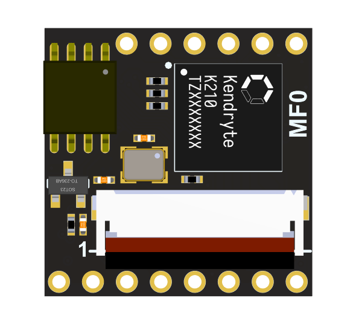
          </td>
          <td>
              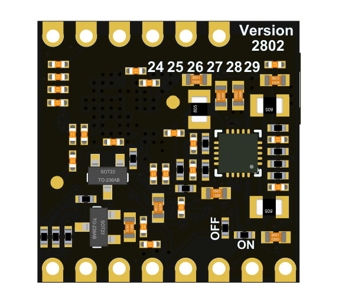
          </td>
      </tr>
      <!-- <tr>
          <td width="100">MF0 Dock</td>
          <td>
              
          </td>
          <td>
              
          </td>
      </tr> -->
  </table>

### Product advantages:

  * Support face recognition
  * Module size super mini
  * Module onboard serial port firmware, free of development
  * Support real-time image transmission of serial camera images

### Application scenario:

  * Face recognition access control
  * Face tracking gimbal

-----
## **Hardware Parameters**

### Module features:

-CPU: RISC-V 64bit dual-core processor, 400Mhz standard frequency (overclockable)
-Image recognition: QVGA@60FPS/VGA@30FPS
-Deep learning framework: TensorFlow/Keras/Darknet
-Peripherals: FPIOA, UART, GPIO, SPI, I²C, I²S, WDT, TIMER, etc
-2.54mm pitch DIP/SMT pad
-Can be connected to a breadboard
-Onboard camera connector
-ROM: 4MByte
-RAM: 6MByte (General purpose) + 2MByte (KPU dedicated)

### Interface definition:

| No. | Description |
| ---- | -------------------------------------------- --- |
| 24 | User IO24 |
| 25 | User IO25 |
| 26 | User IO26, MF0_Dock(LCD_RST) |
| 27 | User IO27, MF0_Dock(LCD_CLK) |
| 28 | User IO28, MF0_Dock(LCD_DC) |
| 29 | User IO29, MF0_Dock(LCD_SDA) |
| --- | --- |
| BOOT | Power-on boot mode selection (user IO16, not recommended for users) |
| IO5 | User IO5 (ISP_TX) |
| IO4 | User IO4 (ISP_RX) |
| EN | MF0 power enable pin, default high level enable |
| RST | K210 reset pin |
| VIN | External power supply 3.4-5.9V (5.0V recommended) |
| GND | External power supply ground |
| 3V3 | Module power supply 3.3V output |

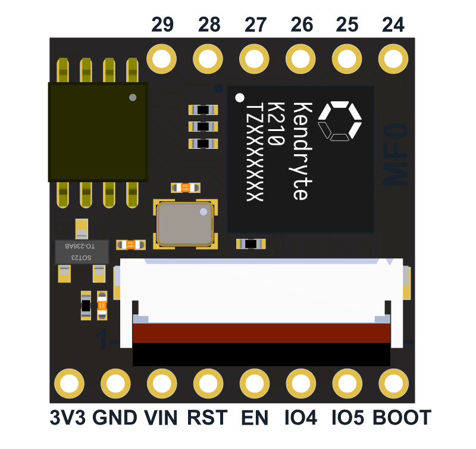

Dock interface definition

| No. | Description |
| --- | ---------------------------------- |
| 24 | User IO24 |
| 25 | User IO25 |
| VIN | External power supply 3.4-5.9V (5.0V recommended) |
| GND | External power supply ground |

> **Detailed hardware information can be downloaded from [download site](https://api.dl.sipeed.com/shareURL/MAIX/HDK/Sipeed-MF0)**

-----
## **`MF0` Module Quick Start Guide**


The user gets the MF0, check whether the following configuration list is consistent with the purchased product.

### configuration list:

| Package | |
| ------------ | ------------------------------------ --------------------------- |
| MF0 core board | MF0 core board, row mother 6Pinx2 |
| MF0 DOCK package | MFO core board + MFODock expansion backplane, GC0328 camera, female header 6Pin×2, 1.3-inch screen. |

### Hardware connection:

Connect to **MF0** through **Serial to USB module**, the connection method is as follows, light up the screen to confirm that the board can work normally.

MF0 hardware connection

| No. | Serial to USB Module | MF0 IO |
| --- | ------------- | ------ |
| 1 | 5V | VIN |
| 2 | GND | GND |
| 3 | TX | IO4 |
| 4 | RX | IO5 |
| 5 | DTR | BOOT |
| 6 | RTS | RST |
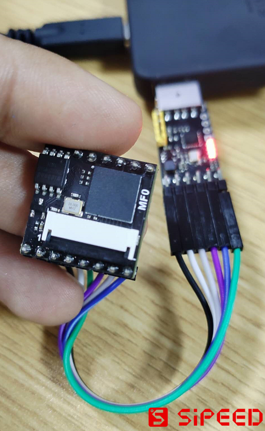

Hardware connection of MF0 Dock

| No. | Serial to USB Module | MF0 IO |
| --- | ------------- | ------ |
| 1 | 5V | VIN |
| 2 | GND | GND |
| 3 | TX | IO4 |
| 4 | RX | IO5 |

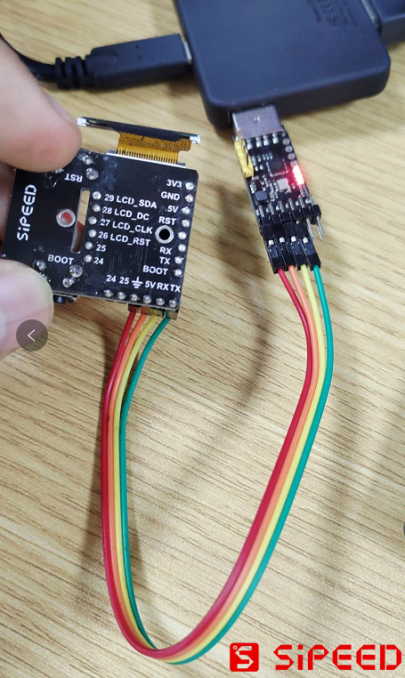


### Software Installation:

The software to be installed is:

[Sipeed MF module debugging assistant](../tools/serail_port_tools/serail_tools_backen.7z)

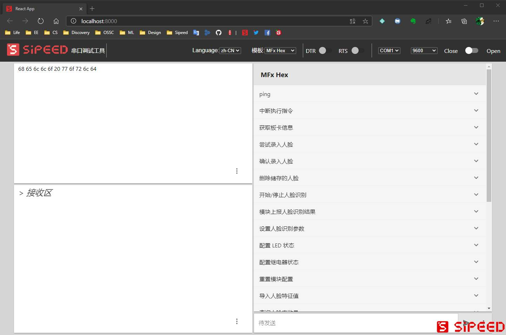

Serial debugging assistant, recommended here [XCOM](../tools/serail_port_tools/XCOM%20V2.6.exe)

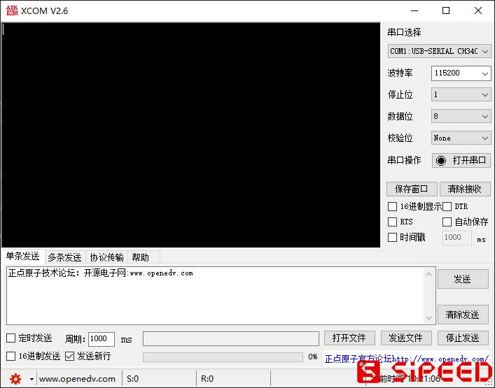


### Face recognition, add and delete:

The following is how to use **Sipeed MF module debugging assistant**:

1. The first is to check whether the module is online, open the Sipeed MF module debugging assistant, set the baud rate **115200**, and send the `ping` command after successful connection

    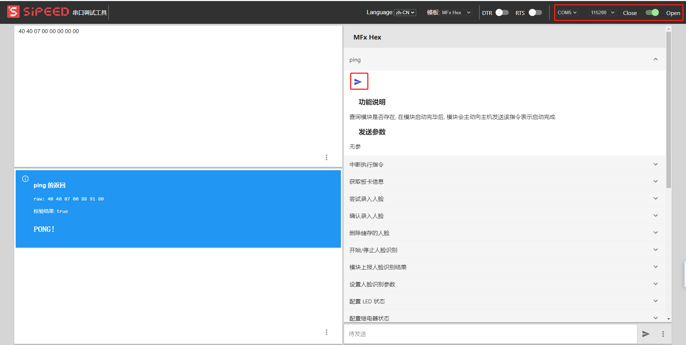

2. Then enter the face, send the command `Try to enter the face`, pay attention to whether the sending parameter **confirm_flag** is uncertain. If it is set to confirm, the face will be temporarily stored in ram (maximum 8 copies), and you need to send the `Enter face` command to save it to the flash. Here, set the ID of the input face to 0, the ID of the number of input faces to 3, and the input timeout time to 5s

    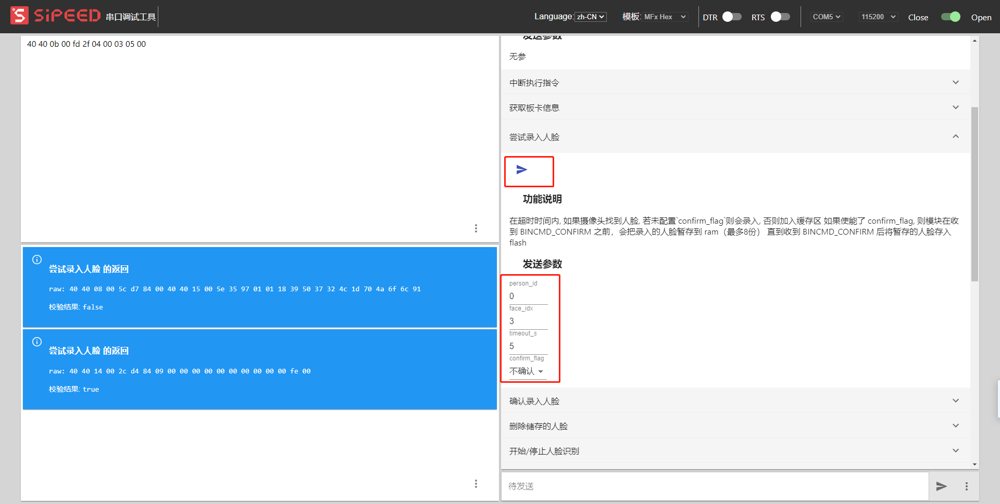

3. Send the `Start/Stop Face Recognition` command to perform face recognition

    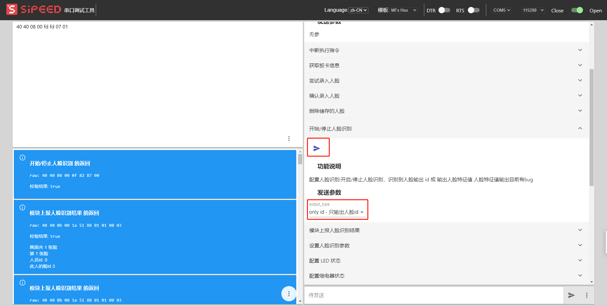

4. The last is the deletion of the face, here is the `delete stored face` command
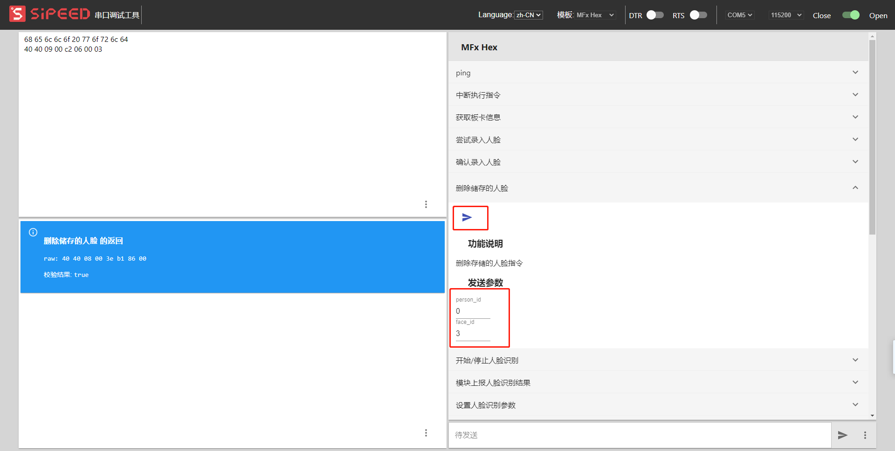

The following is how to use **XCOM**:

MF0 module communicates with MF0 through serial protocol (HEX version), (using IO4 (K210_RX) and IO5 (K210_TX) of MF0)

> The detailed hex firmware protocol can be viewed in [`MF` module general HEX protocol](./p02_mf_protocol_manual_v2_hex_zh_CN.md)


1. Check whether the module is online

    ```
    [17:39:56.803] Receive ←◆40 40 07 00 00 00 00 //After the module is powered on, it sends a ping command to the host, but the host does not reply
    [17:39:58.662] send→◇24 24 07 00 FF FF 00 //The host sends a ping to the module
    [17:39:59.723]Receive ←◆40 40 07 00 88 91 80 //The module replies to pong, the module will calculate the verification at any time, and the host can select the verification
    ```
    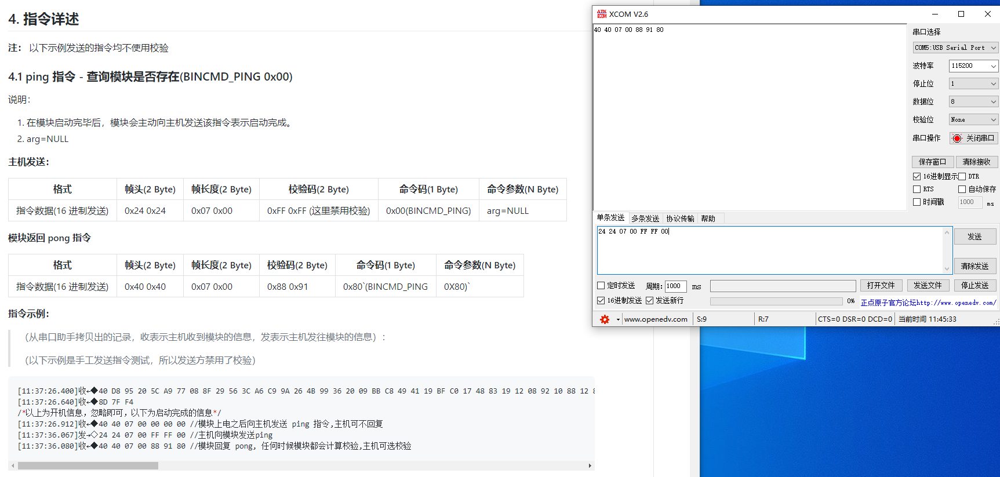

2. Enter the face

    ```
    [16:23:25.593] Send →◇24 24 0B 00 FF FF 04 00 00 05 00 //Enter the face, set the timeout time to 5 seconds
    [16:23:25.648]Receive ←◆40 40 08 00 5C D7 84 00 // Module response received
    [16:23:31.088]Receive ←◆40 40 08 00 16 76 84 0A //No face appears within 5 seconds, the module prompts timeout
    [16:23:55.275] Send→◇24 24 0B 00 FF FF 04 00 00 05 00 //Enter the face again
    [16:23:55.327]Receive←◆40 40 08 00 5C D7 84 00 //Answer
    ```

3. Start/stop face recognition
```
    [22:52:36.525] send →◇24 24 08 00 FF FF 07 01 □ //Turn on face recognition, set to report only id, and you can observe that the infrared light is on
    [22:52:36.639]Close←◆40 40 08 00 83 CE 87 00
    [22:52:38.958]Receive ←◆40 40 0B 00 22 F0 08 01 01 00 02 //recognize the entered face, report it, a total of one face, currently the first one, person00,face02
    [22:52:39.166]Close←◆40 40 0B 00 22 F0 08 01 01 00 02 //The second frame is reported, the time difference is about 0.2s, of which 0.1s is paused in the UI display, which can be adjusted
    [22:52:39.422] Close ←◆40 40 0B 00 22 F0 08 01 01 00 02 //The third frame
    [22:52:41.598]Close←◆40 40 0B 00 22 F0 08 01 01 00 02
    [23:06:44.488]Close ←◆40 40 0B 00 88 23 08 01 01 FF FF //FF FF means stranger
    [23:06:44.648]Close←◆40 40 0B 00 88 23 08 01 01 FF FF
    [22:52:49.471] send→◇24 24 08 00 FF FF 07 02 □ //Set the report id and characteristic value
    [22:52:49.534]Receive ←◆40 40 08 00 83 CE 87 00 //The following is a reply to the feature value of the face in the current image (196B, can also be set to 192/128 simplified version)
    [22:52:50.782] Receive ←◆40 40 CF 00 BE F5 08 01 01 00 00 20 03 0D 1D 24 B9 DD 00 D2 D4 DA E7 E2 51 09 2C E9 15 24 07 E3 32 DF D4 FA 1F EF 0C 3B 45 C6 DD E8 D0 05 EB 13 FB D2 F0 25 F9 FD EF D2 B7 EB 46 22 FF E7 2C E6 C0 04 26 1B 1A 47 CF BC 01 57 00 FA 13 13 19 1D 24 15 38 14 1A 01 13 1C EF 00 F3 F9 FB C4 FF DA F3 26 BE F9 05 F8 F1 D3 E1 BE D8 1F AF 3A BA F9 1B 06 0B FD 23 0B 2E 07 01 0F DD 4D 44 57 F3 FD 1B F8 FB 0C 15 DD BD EB 21 3C 00 09 B7 E4 D5 14 E3 18 21 00 E3 FF ED B9 DC 00 00 3C C8 02 39 0B E5 13 FF 0F 14 FF 17 EF FB CF 15 F3 34 FA 19 ED E2 32 FA E3 3C C6 C6 DA D2 DC 14 ED 27 DC 06 19 27 09 F6 1B F8 FB DA 24 02 FD AF E4 F5 05 0F
    [22:52:57.997] Send →◇24 24 08 00 FF FF 07 00 □ //Stop face recognition, you can observe that the infrared light is off
    [22:52:58.127]Close←◆40 40 08 00 83 CE 87 00
    ```

4. Delete face
```
    [18:43:06.065] send→◇24 24 07 00 FF FF 11 □ //Query the number of people
    [18:43:06.171]Close←◆40 40 0A 00 E8 EA 91 06 00 03 //3 people, 6 pictures
    [18:43:08.169] Send →◇24 24 07 00 FF FF 12 □ //Print owner information
    [18:43:08.187]Close←◆40 40 14 00 0D 0F 92 00 00 00 00 01 00 02 01 00 01 01 02 00
    [18:43:17.661] Post → ◇ 24 24 09 00 FF FF 06 00 02 □ //Delete the 02 picture of person00
    [18:43:17.886]Close←◆40 40 08 00 5B D7 86 00 //Success
    [18:43:29.887] Send →◇24 24 07 00 FF FF 11 □ //Query the number of people
    [18:43:29.948]Close←◆40 40 0A 00 8C 05 91 05 00 03 //Successfully reduced to 3 people, 5 pictures
    [18:43:31.614] Send →◇24 24 07 00 FF FF 12 □ //Print details
    [18:43:31.659]Close←◆40 40 12 00 54 37 92 00 00 00 00 01 01 00 01 01 02 00
    [18:43:33.733] Post → ◇24 24 09 00 FF FF 06 00 FF □ //Delete all pictures of person00
    [18:43:33.899]Close←◆40 40 08 00 5B D7 86 00 //Success
    [18:43:35.797] send→◇24 24 07 00 FF FF 11 □ //Query the number of people
    [18:43:35.851]Close←◆40 40 0A 00 DC C2 91 03 00 02 //Successfully become 2 people, 3 pictures
    [18:43:37.797] Send →◇24 24 07 00 FF FF 12 □ //Print details
    [18:43:37.868]Close←◆40 40 0E 00 7A 69 92 00 01 00 01 01 02 00
    ```

### Serial port camera image real-time image transmission:

1. The first is to use **XCOM** to set the serial port image transmission function

    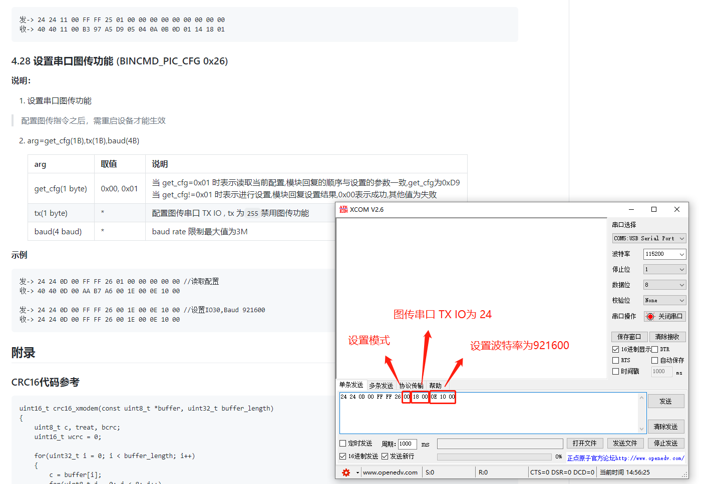

2. Then use a **Serial port to USB module** to connect with **MF0 module**. Here, **Sipeed dual serial port to USB module** is used, so there is no need to connect a serial port to USB module. Of course, if you no longer need to read the serial port information, you can use only one. The image transmission serial port set here is **User IO24**. The specific connection method is as follows:

    | No. | Serial to USB Module | MF0 IO |
    | --- | ------------- | ------ |
    | 1 | RX | 24 |
    | 2 | GND | GND |

    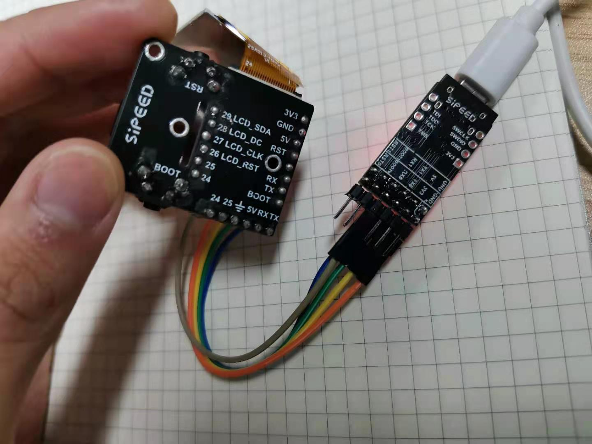

3. Then install the serial port camera debugging software. It is recommended to use [XCAM](../tools/serail_port_tools/XCAM%20V1.0.exe), and you can see the real-time image transmission after opening it.

    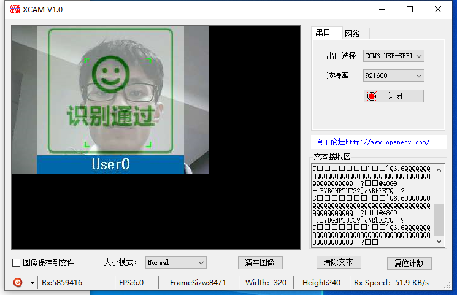

### Update firmware:

The connection method for updating the firmware is the same as the above-mentioned [hardware connection](#五金连接)

Users can use [kflash_gui](../tools/kflash_gui_v1.6.6_windows.7z) to download the MF0 firmware

**When downloading using kflash_gui, you need to press the boot and rst buttons, and release the rst first and then the boot button to ensure that the K210 enters the download mode (ISP mode)**

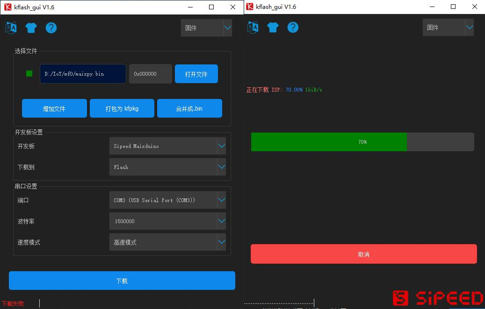
