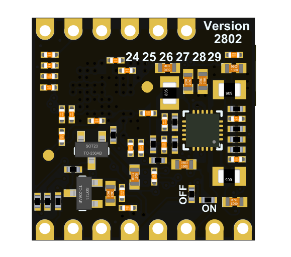
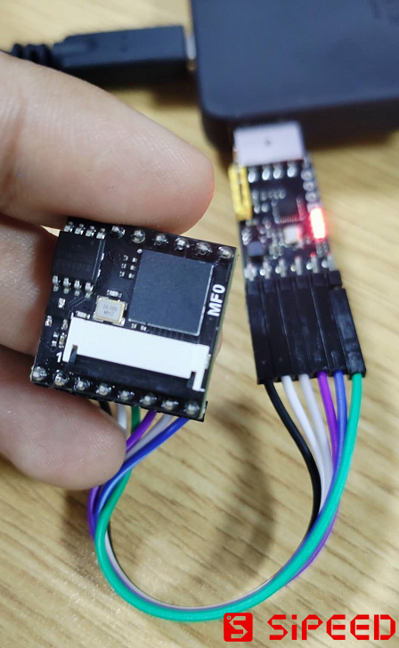
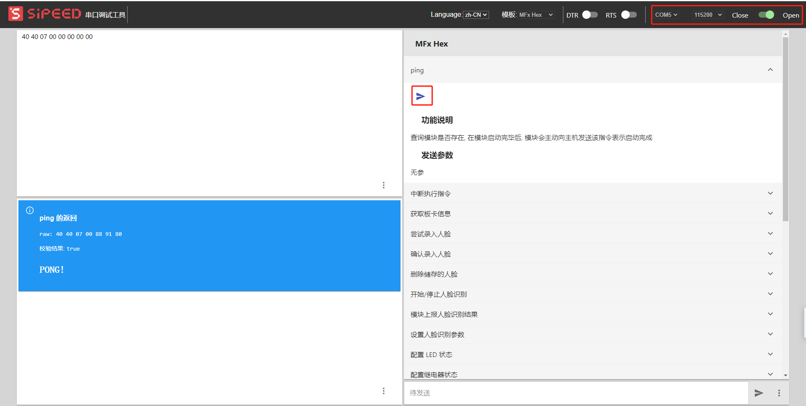
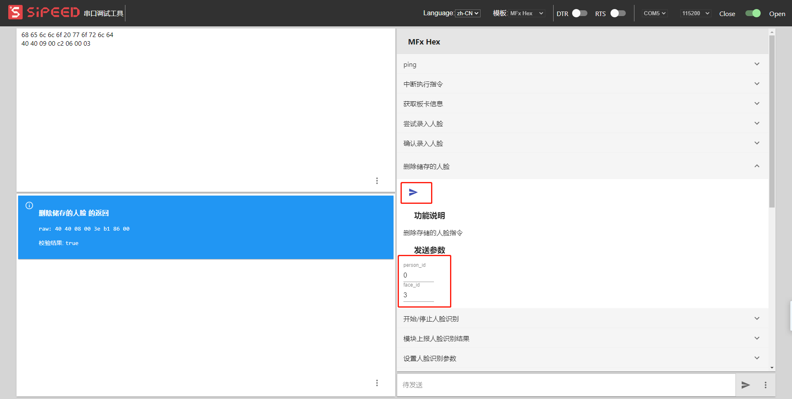
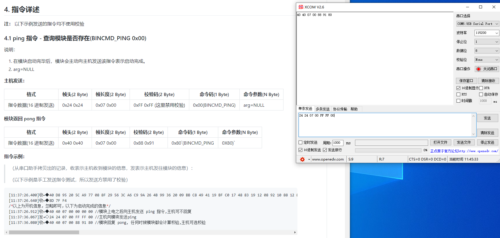
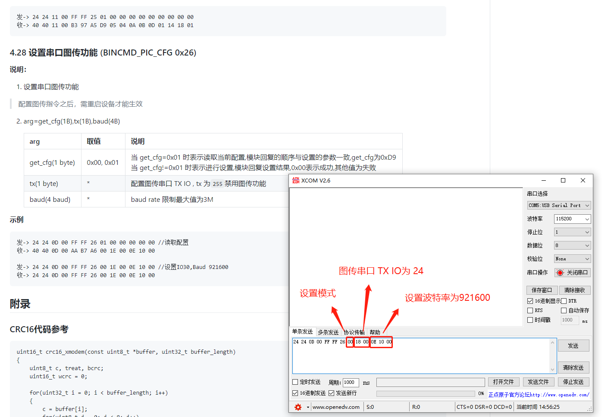
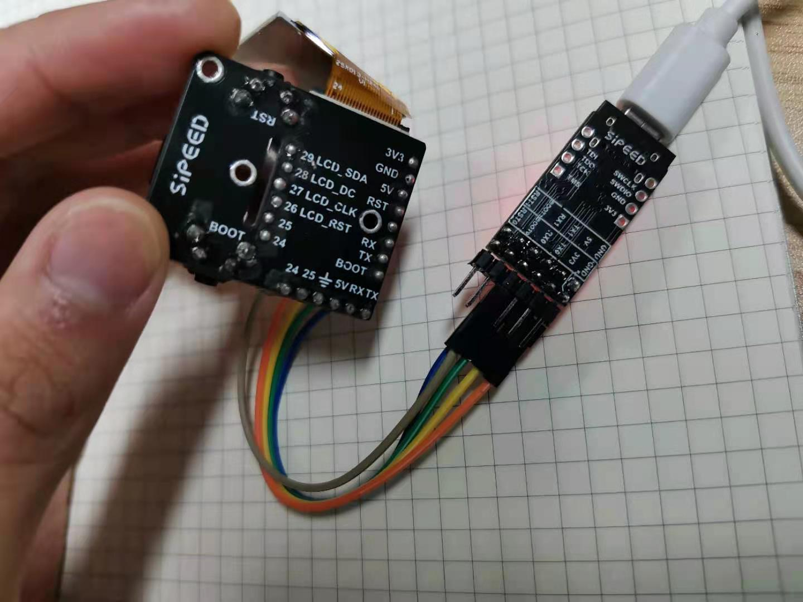

# `MF0` 模块简明用户手册

本节目录：

- [`MF0` 模块简明用户手册](#mf0-模块简明用户手册)
  - [**模块介绍**](#模块介绍)
    - [产品简介：](#产品简介)
    - [外观一览：](#外观一览)
    - [产品优势：](#产品优势)
    - [应用场景：](#应用场景)
  - [**硬件参数**](#硬件参数)
    - [模块特性：](#模块特性)
    - [接口定义：](#接口定义)
  - [**`MF0` 模块快速上手指南**](#mf0-模块快速上手指南)
    - [配置清单：](#配置清单)
    - [硬件连接：](#硬件连接)
    - [软件安装：](#软件安装)
    - [人脸识别,增加和删除：](#人脸识别增加和删除)
    - [串口摄像头图像实时图传：](#串口摄像头图像实时图传)
    - [更新固件：](#更新固件)


-----
## **模块介绍**

### 产品简介：

`SipeedMF0`是Sipeed团队推出的一款人脸识别核心模块，SipeedMF0板载RISC-V高性能处理器，芯片集成KPU处理单元，可以进行多种AIOT开发。为了大家能快速进行人脸识别等应用的开发，Sipeed团队在此基础上开发人脸识别串口固件，使用HEX协议，方便STM32等通用MCU的快速对接。

### 外观一览：

MF0 人脸识别模块外观一览

<table border="3">
      <tr>
          <th colspan=3>MF0</th>
      </tr>
      <tr>
          <td  width="100">描述</td>
          <td>正面视图</td>
          <td>背面视图</td>
      </tr>
      <tr>
          <td  width="100">MF0</td>
          <td>
              
          </td>
          <td>
              
          </td>
      </tr>
      <!-- <tr>
          <td  width="100">MF0 Dock</td>
          <td>
              
          </td>
          <td>
              
          </td>
      </tr> -->
  </table>

### 产品优势：

  * 支持人脸识别
  * 模块尺寸超级迷你
  * 模块板载串口固件，免开发
  * 支持串口摄像头图像实时图传

### 应用场景：

  * 人脸识别门禁
  * 人脸追踪云台

-----
## **硬件参数**

### 模块特性：

- CPU ：RISC-V 64bit 双核处理器, 400Mhz 标准频率（可超频）
- 图像识别：QVGA@60FPS/VGA@30FPS
- 深度学习框架：TensorFlow/Keras/Darknet
- 外设：FPIOA、UART、GPIO、SPI、I²C、I²S、WDT、TIMER、etc
- 2.54mm 间距 DIP/SMT 焊盘
- 能连接到面包板
- 板载摄像头连接器
- ROM：4MByte
- RAM：6MByte （通用） + 2MByte （ KPU 专用）

### 接口定义：

| No.  | 描述                                            |
| ---- | ----------------------------------------------- |
| 24   | 用户 IO24                                       |
| 25   | 用户 IO25                                       |
| 26   | 用户 IO26，MF0_Dock(LCD_RST)                    |
| 27   | 用户 IO27，MF0_Dock(LCD_CLK)                    |
| 28   | 用户 IO28，MF0_Dock(LCD_DC)                     |
| 29   | 用户 IO29，MF0_Dock(LCD_SDA)                    |
| ---  | ---                                             |
| BOOT | 上电 boot 模式选择（用户 IO16，不建议用户使用） |
| IO5  | 用户 IO5（ISP_TX）                              |
| IO4  | 用户 IO4（ISP_RX）                              |
| EN   | MF0 电源使能引脚, 默认高电平使能                |
| RST  | K210 复位引脚                                   |
| VIN  | 外部供电电源 3.4-5.9V（推荐 5.0V）              |
| GND  | 外部供电电源地                                  |
| 3V3  | 模块电源 3.3V 输出                              |


Dock 接口定义

| No. | 描述                               |
| --- | ---------------------------------- |
| 24  | 用户 IO24                          |
| 25  | 用户 IO25                          |
| VIN | 外部供电电源 3.4-5.9V（推荐 5.0V） |
| GND | 外部供电电源地                     |

> **详细的硬件资料可以通过[下载站](https://api.dl.sipeed.com/shareURL/MAIX/HDK/Sipeed-MF0)下载**

-----
## **`MF0` 模块快速上手指南**


用户拿到 MF0， 检查一下有下列的配置清单和购买产品是否一致。

### 配置清单：

| 套餐         |                                                                 |
| ------------ | --------------------------------------------------------------- |
| MF0 核心板   | MF0核心板，排母6Pinx2                                           |
| MF0 DOCK套餐 | MFO核心板+MFODock扩展底板，GC0328摄像头， 排母6Pin×2，1.3寸屏。 |

### 硬件连接：

通过 **串口转USB模块** 与 **MF0** 相连，连接方式如下，点亮屏幕确认板子能正常工作。

MF0 的硬件连接

| No. | 串口转USB模块 | MF0 IO |
| --- | ------------- | ------ |
| 1   | 5V            | VIN    |
| 2   | GND           | GND    |
| 3   | TX            | IO4    |
| 4   | RX            | IO5    |
| 5   | DTR           | BOOT   |
| 6   | RTS           | RST    |


MF0 Dock 的硬件连接

| No. | 串口转USB模块 | MF0 IO |
| --- | ------------- | ------ |
| 1   | 5V            | VIN    |
| 2   | GND           | GND    |
| 3   | TX            | IO4    |
| 4   | RX            | IO5    |


### 软件安装：

需要安装的软件有：

[Sipeed MF 模块调试助手](../tools/serail_port_tools/serail_tools_backen.7z)


串口调试助手，这里推荐使用 [XCOM](../tools/serail_port_tools/XCOM%20V2.6.exe)


### 人脸识别,增加和删除：

下面为使用 **Sipeed MF 模块调试助手** 的方法：

1. 首先是检测模块是否在线，打开 Sipeed MF 模块调试助手，设置波特率 **115200**，成功连接后发送 `ping` 指令

    

2. 然后是录入人脸，发送 `尝试录入人脸` 指令，注意设置发送参数 **confirm_flag** 是否为不确定。如果设置了确定，人脸会暂存到ram（最多8份），还需要发送 `确定录入人脸` 指令,才能存入flash。这里设置录入人脸的ID为0，录入人脸张数ID为3，录入超时时间为5s

    

3. 发送 `开始/停止人脸识别` 指令，进行人脸的识别

    

4. 最后是人脸的删除，这里发送 `删除存储的人脸` 指令

    

下面为使用 **XCOM** 的方法：

MF0模块通过串口协议(HEX版)与MF0进行通信,(使用MF0的IO4(K210_RX)和IO5(K210_TX))

> 详细的 hex 固件协议可以查看 [ `MF` 模块通用 HEX 协议](./p02_mf_protocol_manual_v2_hex_zh_CN.md)


1. 检测模块是否在线

    ```
    [17:39:56.803]收←◆40 40 07 00 00 00 00 //模块上电之后向主机发送 ping 指令,主机可不回复
    [17:39:58.662]发→◇24 24 07 00 FF FF 00 //主机向模块发送ping
    [17:39:59.723]收←◆40 40 07 00 88 91 80 //模块回复 pong, 任何时候模块都会计算校验,主机可选校验
    ```
    

2. 录入人脸

    ```
    [16:23:25.593]发→◇24 24 0B 00 FF FF 04 00 00 05 00 //录入人脸，设置超时时间为 5 秒
    [16:23:25.648]收←◆40 40 08 00 5C D7 84 00 // 模块应答收到
    [16:23:31.088]收←◆40 40 08 00 16 76 84 0A //5 秒内未出现人脸，模块提示超时
    [16:23:55.275]发→◇24 24 0B 00 FF FF 04 00 00 05 00 //再次录入人脸
    [16:23:55.327]收←◆40 40 08 00 5C D7 84 00 //应答
    ```

3. 开始/停止人脸识别

    ```
    [22:52:36.525]发→◇24 24 08 00 FF FF 07 01 □  //开启人脸识别，设置仅上报id，可以观察到红外灯亮起
    [22:52:36.639]收←◆40 40 08 00 83 CE 87 00
    [22:52:38.958]收←◆40 40 0B 00 22 F0 08 01 01 00 02  //识别到录入的人脸，上报，总共一个脸，当前第一个，person00,face02
    [22:52:39.166]收←◆40 40 0B 00 22 F0 08 01 01 00 02  //第二帧上报，时差约0.2s，其中有0.1s是停顿在UI显示，可调整
    [22:52:39.422]收←◆40 40 0B 00 22 F0 08 01 01 00 02  //第三帧
    [22:52:41.598]收←◆40 40 0B 00 22 F0 08 01 01 00 02
    [23:06:44.488]收←◆40 40 0B 00 88 23 08 01 01 FF FF  //FF FF 表示陌生人
    [23:06:44.648]收←◆40 40 0B 00 88 23 08 01 01 FF FF
    [22:52:49.471]发→◇24 24 08 00 FF FF 07 02 □         //设置上报id及特征值
    [22:52:49.534]收←◆40 40 08 00 83 CE 87 00           //下面回复了当前图像中脸的特征值(196B,也可设置为192/128精简版)
    [22:52:50.782]收←◆40 40 CF 00 BE F5 08 01 01 00 00 20 03 0D 1D 24 B9 DD 00 D2 D4 DA E7 E2 51 09 2C E9 15 24 07 E3 32 DF D4 FA 1F EF 0C 3B 45 C6 DD E8 D0 05 EB 13 FB D2 F0 25 F9 FD EF D2 B7 EB 46 22 FF E7 2C E6 C0 04 26 1B 1A 47 CF BC 01 57 00 FA 13 13 19 1D 24 15 38 14 1A 01 13 1C EF 00 F3 F9 FB C4 FF DA F3 26 BE F9 05 F8 F1 D3 E1 BE D8 1F AF 3A BA F9 1B 06 0B FD 23 0B 2E 07 01 0F DD 4D 44 57 F3 FD 1B F8 FB 0C 15 DD BD EB 21 3C 00 09 B7 E4 D5 14 E3 18 21 00 E3 FF ED B9 DC 00 00 3C C8 02 39 0B E5 13 FF 0F 14 FF 17 EF FB CF 15 F3 34 FA 19 ED E2 32 FA E3 3C C6 C6 DA D2 DC 14 ED 27 DC 06 19 27 09 F6 1B F8 FB DA 24 02 FD AF E4 F5 05 0F
    [22:52:57.997]发→◇24 24 08 00 FF FF 07 00 □  //停止人脸识别，可以观察到红外灯关闭
    [22:52:58.127]收←◆40 40 08 00 83 CE 87 00
    ```

4. 删除人脸

    ```
    [18:43:06.065]发→◇24 24 07 00 FF FF 11 □        //查询人数
    [18:43:06.171]收←◆40 40 0A 00 E8 EA 91 06 00 03 //3人，6张图片
    [18:43:08.169]发→◇24 24 07 00 FF FF 12 □        //打印所有人信息
    [18:43:08.187]收←◆40 40 14 00 0D 0F 92 00 00 00 00 01 00 02 01 00 01 01 02 00
    [18:43:17.661]发→◇24 24 09 00 FF FF 06 00 02 □  //删除person00的 02号图
    [18:43:17.886]收←◆40 40 08 00 5B D7 86 00       //成功
    [18:43:29.887]发→◇24 24 07 00 FF FF 11 □        //查询人数
    [18:43:29.948]收←◆40 40 0A 00 8C 05 91 05 00 03 //成功减为3人，5张图
    [18:43:31.614]发→◇24 24 07 00 FF FF 12 □        //打印详情
    [18:43:31.659]收←◆40 40 12 00 54 37 92 00 00 00 00 01 01 00 01 01 02 00
    [18:43:33.733]发→◇24 24 09 00 FF FF 06 00 FF □  //删除person00的所有图片
    [18:43:33.899]收←◆40 40 08 00 5B D7 86 00       //成功
    [18:43:35.797]发→◇24 24 07 00 FF FF 11 □        //查询人数
    [18:43:35.851]收←◆40 40 0A 00 DC C2 91 03 00 02 //成功变为2人，3张图
    [18:43:37.797]发→◇24 24 07 00 FF FF 12 □        //打印详情
    [18:43:37.868]收←◆40 40 0E 00 7A 69 92 00 01 00 01 01 02 00
    ```

### 串口摄像头图像实时图传：

1. 首先是使用 **XCOM** 设置串口图传功能

    

2. 然后是再使用一块 **串口转USB模块** 和 **MF0模块** 相连,这里用了 **Sipeed双串口转USB模块** ，省去再接一个串口转USB模块。当然，如果不再需要读取串口信息，只用一个也是可以的，这里设置的图传串口为 **用户IO24**，具体的连接方法如下：

    | No. | 串口转USB模块 | MF0 IO |
    | --- | ------------- | ------ |
    | 1   | RX            | 24     |
    | 2   | GND           | GND    |

    

3. 然后是安装串口摄像头调试软件，这里推荐使用[XCAM](../tools/serail_port_tools/XCAM%20V1.0.exe),打开后就可以看到实时图传

    

### 更新固件：

更新固件的连接方式和上面所说的[硬件连接](#硬件连接)一样

用户可以使用 [kflash_gui](../tools/kflash_gui_v1.6.6_windows.7z) 下载 MF0 固件

**使用 kflash_gui 下载时，需要按下 boot 和 rst 按键，并先松开 rst 再松开 boot 按键，确保 K210 进入下载模式（ISP 模式）**


