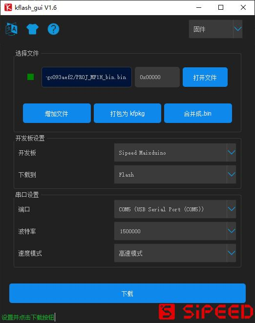

# MF1 固件更新说明（与机器码 key 获取说明）

## 概述

在使用 MF 系列人脸识别模块过程中, 由于开发与生产周期的原因，并无法保证开发者拿到手上就是最新的版本的固件（期间开发人员修复了某些 bug,或者新增了指令），所以建议上手之后确认固件版本。

- 获取版本信息方法（待更新）

    TODO: 获取版本信息方法

注意！！！

完整烧录步骤：

1. 烧录 key_gen，获取机器码，发送到 support@sipeed.com, 获取对应人脸模型文件
2. 烧录对应板型固件(选择自己需要的协议: 出厂默认 json, 可选 hex 版本)
3. 烧录字体文件
4. 烧录图片资源(可选中英文，可自己替换打包)
5. 烧录第一步获取的人脸模型文件
6. 烧录清除配置文件(或者使用 kflash_gui 清除板级配置信息)

## 固件版本说明

MF 系列固件下载连接: [https://dl.sipeed.com/MAIX/factory_firmware/MF_Module](https://dl.sipeed.com/MAIX/factory_firmware/MF_Module)

- 烧录固件时注意 区分摄像头方向

| 描述 | 摄像头丝印 | 说明 |
| --- | --- | --- |
| 横向（H）| | |
| 竖向（V）| | |

> 烧录固件之前，一定要确认选择的固件和自己的**板型一致**，
烧录之后建议均擦除下**板级配置信息**

| 文件名 | 适用板型 | 说明 |
| --- | --- | --- |
|PROJ_MF1H_TO_MF2H_bin.bin   | MF1 转 2.4/2.8 寸, 摄像头方向: 横向(H)   | HEX 协议 |
|PROJ_MF1H_TO_MF2H_json.bin  | MF1 转 2.4/2.8 寸, 摄像头方向: 横向(H)   | JSON 协议 |
|   |   |   |
|PROJ_MF1H_bin.bin           | MF1 1.3 寸 IPS, 摄像头方向: 横向(H)      | HEX 协议 |
|PROJ_MF1H_json.bin          | MF1 1.3 寸 IPS, 摄像头方向: 横向(H)      | JSON 协议 |
|   |   |   |
|PROJ_MF1V_TO_MF2V_bin.bin   | MF1 转 2.4/2.8 寸, 摄像头方向: 竖向(V)   | HEX 协议 |
|PROJ_MF1V_TO_MF2V_json.bin  | MF1 转 2.4/2.8 寸, 摄像头方向: 竖向(V)   |JSON 协议 |
|   |   |   |
|PROJ_MF1V_bin.bin           | MF1 1.3 寸 IPS, 摄像头方向: 竖向(V)      | HEX 协议 |
|PROJ_MF1V_json.bin          | MF1 1.3 寸 IPS, 摄像头方向: 竖向(V)      | JSON 协议 |
|   |   |   |
|PROJ_MF2V_bin.bin           | MF2 2.4/2.8 寸, 摄像头方向: 竖向(V)      | HEX 协议 |
|PROJ_MF2V_json.bin          | MF2 2.4/2.8 寸, 摄像头方向: 竖向(V)      | JSON 协议 |
|   |   |   |
|protocol_bin.md             |                                         | BIN(HEX) 原始协议文件 |
|protocol_json.md            |                                         | JSON 原始协议文件 |
|release.md                  |                                         | 版本更新记录 |
+

注意：

MF1 TO MF2(即 MF1 外接 2.4/2.8 寸屏幕), USB Type-C 转串口(IO4:TX,RX:IO5)为日志信息输出串口，
IO10(TX), IO11(RX) 为协议串口，用户可以通过指令修改串口 IO

## MF1 固件更新说明

用户可以使用 [`kflash_gui` (https://github.com/sipeed/kflash_gui/releases)](https://github.com/sipeed/kflash_gui/releases) 来下载程序

具体流程为：

- ① 打开需要烧录的固件，如果是 `bin` 文件，请确保地址为 `0x00` ,是 `kfpkg` 文件时，不需要选择地址

- ② 选择开发板型号，`MF1` 模块请选择 `Sipeed MaixDuino`

- ③ 选择串口，`MF1` 模块，请选择第一个串口()

- ④ 点击 `下载`，开始下载

## 怎么获取 Key(机器码)

在使用过程中,如果模块的模型丢失或需要更换,需要发送 `Key` 到 <Support@sipeed.com>

在使用过程中, 如果模块的模型丢失或需要更换, 获取 **Key(机器码)** 及烧录固件流程如下

- 1.烧录 key
- 2.发送 key 到 support 邮箱(负责人员开发任务重，请耐性等待回复[可能需要一天])
- 3.烧录 MF1 固件
- 4.烧录 support 邮箱发送的人脸模型(有横竖屏两种模型，**不一定两个都可以用**，请自行尝试)

---

推荐发送邮件格式如下:

> 问题类型: 模型丢失/更换模型
>
> 使用硬件/固件版本: MF1
>
> 内容: 模型丢失
>
> 机器码: [xxxxxxxxxxxxxxxxxxxxx]

首先下载 [key_gen.bin](https://fdvad021asfd8q.oss-cn-hangzhou.aliyuncs.com/Sipeed_M1/firmware/key_gen_v1.2.bin)

使用 `kflash_gui` 将固件 `ken_gen.bin` 烧录到模块中之后,打开串口,波特率为`115200,8,N,1`

> **[kflash_gui](https://github.com/Sipeed/kflash_gui/releases)** 为 K210 固件烧录工具, 源码: [**Sipeed/kflash_gui**](https://github.com/Sipeed/kflash_gui)

建议使用 [`XCOM`](tools/XCOM_V2.2.exe) 来看串口信息

轻点 `DTR` ,再松开,即可使模块复位,看到启动信息

