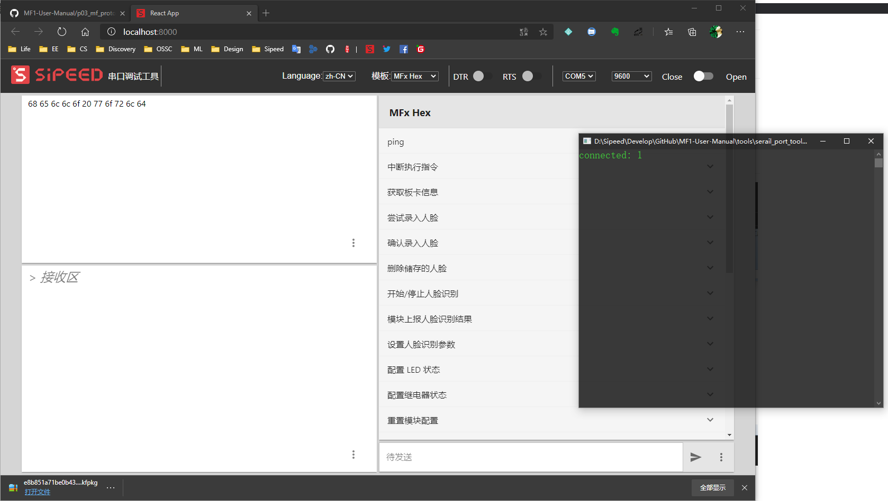
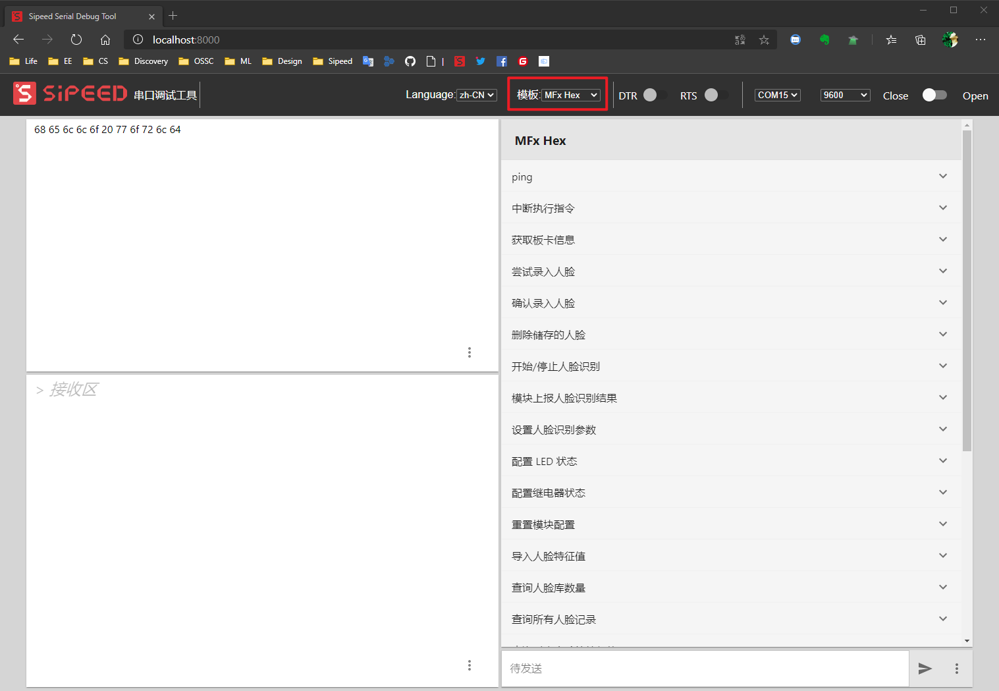
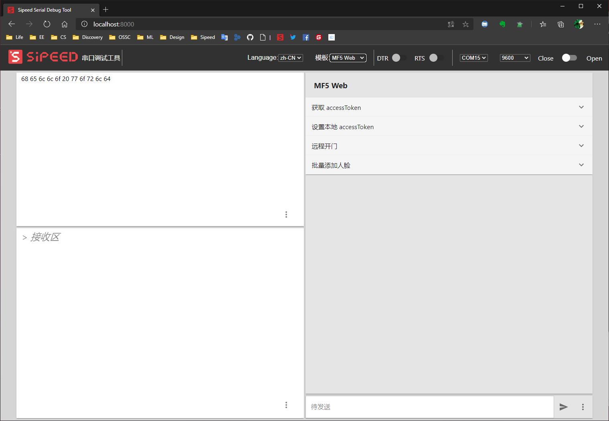
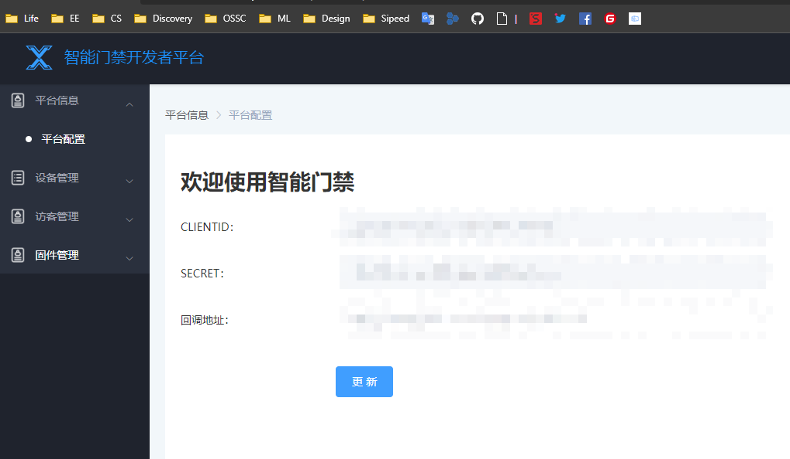
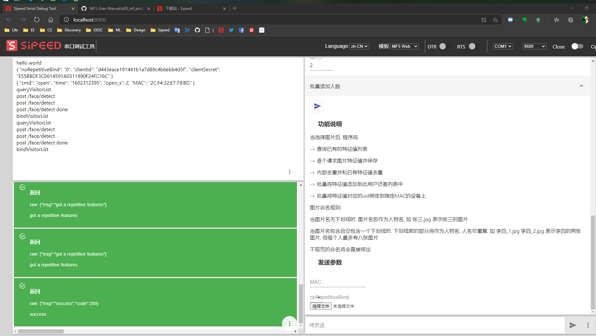

# Sipeed MF 调试助手

为了方便用户使用 MF 系列人脸识别模组，我们设计并开发了 Sipeed MF 调试助手。

## Sipeed MF 调试助手 使用说明

### 调试助手下载

Sipeed 下载站链接(待更新): 

GitHub 下载: [serail_tools_backen](../tools/serail_port_tools/serail_tools_backen.7z)

##  解压并运行串口调试助手

运行 main.exe 之后 串口会自动打开终端串口，并打开浏览器页面 “http://localhost:8000/”， 如果页面呈现空白状态请按键 `Ctrl+F5` 强制刷新浏览器缓存。

## 功能说明

Sipeed MF 调试助手主要分为三个模板板块：

- MF HEX 串口协议测试板块
- MF JSON 串口协议测试板块
- MF5 Web 测试板块

三个板块分别是针对 MF 模块 HEX 协议的功能测试、 MF 模块 JSON 协议的功能测试、
MF5 Web 功能测试

### MF HEX 串口协议测试板块

MF HEX 串口协议测试板块 针对的是 MF 模块 HEX 协议版本的固件而开发的测试功能，

使用方法：通过 USB 连接 MF 模块的协议串口，选择波特率 `115200`, 点击打开即可使用

### MF JSON 串口协议测试板块

MF JSON 串口协议测试板块 针对的是 MF 模块 JSON 协议版本的固件而开发的测试功能，

使用方法：通过 USB 连接 MF 模块的协议串口，选择波特率 `115200`, 点击打开即可使用

### MF5 Web 测试板块

MF5 web 调试功能需要结合 **Sipeed MF “智能门禁开发者平台”**使用。

注册并登录 `Sipeed MF "智能门禁开发者平台"`, 即可看到 `clientId`和`clientSecret`

- 获取 `accessToken`

  - 方案1: 全局刷新, 在界面选择`获取 accessToken`, 使用`clientId`和`clientSecret`刷新获取`accessToken`, 将会刷新全局AccessToken, 因此其他Token将会失效, 生产环境请谨慎使用

  - 方案2: 从中控服务器导出一份`accessToken`, 在界面选择`设置本地accessToken`, 填入你所拿到的`accessToken`

- 批量添加人脸:

> 这里批量添加人脸的是全量添加，即会清空原有添加的人脸记录

  

填入设备 MAC 后选择所有文件之后会自动开始发送请求, 可以将发送区调为纯文本模式来查看更详细的流程状态

## 更新记录

>

## 具体使用请自行尝试
