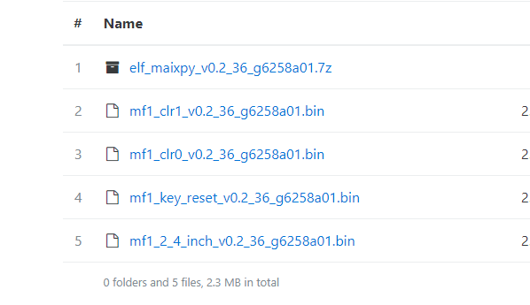

# 怎样获取 Key 及固件版本说明

## 怎么获取 Key(机器码)

在使用过程中,如果模块的模型丢失或需要更换,需要发送 `Key` 到[Support@sipee.com](support@sipeed.com)

推荐发送邮件格式如下:

> 问题类型: 模型丢失/更换模型
> 
> 使用硬件/固件版本: MF1
> 
> 内容: 模型丢失
> 
> 机器码: [xxxxxxxxxxxxxxxxxxxxx]

首先下载[key_gen.bin](https://fdvad021asfd8q.oss-cn-hangzhou.aliyuncs.com/Sipeed_M1/firmware/key_gen_v1.2.bin)

使用 `kflash_gui` 将固件 `ken_gen.bin` 烧录到模块中之后,打开串口,波特率为`115200,8,N,1`

建议使用[`XCOM`](tools/XCOM_V2.2.exe)来看串口信息

轻点`DTR`,再松开,即可使模块复位,看到启动信息

## 固件版本说明

MF1 下载连接: [https://cn.dl.sipeed.com/MAIX/SDK/](https://cn.dl.sipeed.com/MAIX/SDK/)

不同固件版本说明如下:

| 固件文件名称 | 描述 |
| --- | --- |
| elf_maixpy_xxx.7z | *.elf |
| mf1_clr1_xxx.bin | 长按键, 清除人脸特征值
| mf1_clr0_xxx.bin | 长按键, 不清除人脸特征值
| mf1_key_reset_xxx.bin | 长按键, 无任何操作 |
| mf1_2_4_inch_xxx.bin | 针对 2.4/2.8' 横屏 LCD， 烧录之后再烧录清除配置文件 [fix_flash_cfg.kfpkg](https://cn.dl.sipeed.com/MAIX/SDK/MF1_SDK_Prebuild/dev/fix_flash_cfg.kfpkg)
